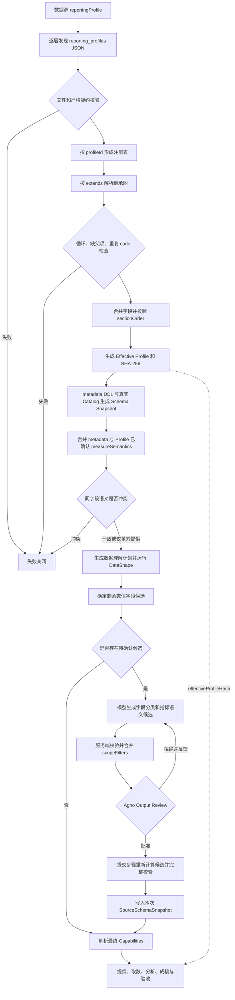

# Report Agent Profile 配置规约

本文是 Reporting Profile 的唯一专用说明。Profile 负责表达稳定、可审核的业务配置，例如医院、院区、
管理条线、报告模板、章节标题和固定数据范围；它不保存连接信息，也不根据字段名猜测会随数据变化的
聚合口径。

## 整体流程



关键边界如下：

- 模型只能提出候选，不能写 Profile、Workflow state 或自行批准语义。
- 用户批准后，独立提交步骤重新基于当前 Snapshot 计算候选集合；缺项、增项、未知字段和范围冲突均
  失败关闭。
- Profile `scopeFilters` 是服务端强制范围，会确定性进入指标 `exclusiveScope`，模型不能删除或覆盖。
- `effectiveProfileHash` 覆盖所有生效层和最终内容，报告产物必须绑定该 hash。

## 目录与加载

每个配置层的文件位于 `reporting_profiles/**/*.json`。子目录只用于整理文件，不产生隐式语义；
`hospitals/`、`organizations/` 和 `templates/` 都不是保留关键字，继承关系只由 JSON 中的 `extends`
决定。

加载器从部署配置边界到本次运行目录逐层查找 `reporting_profiles/`：

1. 父目录先加载，越接近运行目录的配置层越晚加载。
2. 子配置层出现相同 `profileId` 时，整份文档替换父配置层的同 ID 文档，不做跨目录字段级合并。
3. 注册完成后，再依据 `extends` 解析 Profile 内部继承。
4. 文件必须是普通 UTF-8 JSON，单文件不超过 1 MiB；目录和文件均不接受符号链接。
5. 最多加载 500 个生效 Profile。未知字段、同层重复 ID、无效 JSON 或连接字段均拒绝。

部署示例位于
[`deploy/agentos/reporting/reporting_profiles/`](../../../../deploy/agentos/reporting/reporting_profiles/)：

| Profile | 分层职责 | 直接父 Profile |
| --- | --- | --- |
| `base` | 领域无关的五个中文基础章节和默认版式 | 无 |
| `ruijin` | 瑞金医院真实 Schema 的稳定维度映射和经营章节 | `base` |
| `ruijin-north` | 北部院区固定范围覆盖 | `ruijin` |
| `finance` | 财务条线章节和版式差异 | `ruijin` |
| `monthly-operation` | 月度经营报告模板 | `ruijin` |
| `budget-execution` | 预算执行专题模板 | `ruijin` |

数据源只引用最终要解析的一个 Profile ID：

```json
{
  "id": "rj",
  "type": "starrocks",
  "dsnEnv": "REPORT_STARROCKS_DSN",
  "database": "rj",
  "reportingProfile": "ruijin"
}
```

一次运行选择的所有数据源必须绑定同一 `reportingProfile`。未配置时使用内置的领域无关 Profile。

## 分层与继承

`extends` 可以包含多个父 Profile。父项按声明顺序解析，后解析的父项覆盖先解析的同名字段，最后应用
当前 Profile。共享祖先只合并一次，循环和缺失父项直接失败。

以下字段按稳定 `code` 合并：

- `dimensions`
- `metrics`
- `reconciliations`
- `scopeFilters`
- `sections`

子层只需写需要覆盖的字段；`{"code": "service_workload", "enabled": false}` 会删除继承项，停用对象
不得包含 `code`、`enabled` 之外的字段。`measureSemantics` 不使用 code，而是按不区分大小写的完整
`fieldRef` 覆盖。`pageLayout` 按具体页眉页脚字段覆盖。

医院、院区、条线和模板需要同时生效时，应增加一个最终组合 Profile，而不是依赖目录名。组合层必须
显式给出覆盖所有最终章节的 `sectionOrder`，例如：

```json
{
  "version": "1",
  "profileId": "ruijin-north-finance-monthly",
  "revision": "1",
  "extends": ["ruijin-north", "finance", "monthly-operation"],
  "sectionOrder": [
    "executive_summary",
    "scope_and_methodology",
    "financial_overview",
    "income_and_budget",
    "cost_and_expenditure",
    "project_budget",
    "financial_risk",
    "trend_analysis",
    "structure_analysis",
    "contribution_analysis",
    "anomaly_analysis",
    "key_findings",
    "limitations",
    "recommendations"
  ]
}
```

上例只说明组合方式。是否保留工作量章节、财务章节和模板章节，应由部署方按实际报告职责确定，不应由
Python 代码写入某家医院的条件分支。

## 顶层契约

Profile 使用严格 JSON，所有未知字段都会被拒绝：

| 字段 | 必填 | 作用 |
| --- | --- | --- |
| `version` | 是 | 固定为 `"1"` |
| `profileId` | 是 | 稳定 Profile ID，供数据源引用 |
| `revision` | 是 | 部署方维护的配置修订号 |
| `extends` | 否 | 显式父 Profile ID 列表 |
| `dimensions` | 否 | 已确认的业务维度及其物理字段映射 |
| `metrics` | 否 | 已确认的基础指标或比率指标能力 |
| `reconciliations` | 否 | 两个基础指标之间的确定性对账规则 |
| `measureSemantics` | 否 | 已人工确认的物理数值字段聚合语义 |
| `scopeFilters` | 否 | 医院、院区或组织层的强制固定范围 |
| `sections` | 否 | 报告章节标题和能力依赖 |
| `sectionOrder` | 否 | 最终章节完整顺序 |
| `pageLayout` | 否 | 固定页眉页脚 |

`fieldRef` 一律使用 `sourceId.database.table.column`。Profile 只能引用 Schema Snapshot 中存在的字段，
不能扩大 metadata DDL 和真实 Catalog 的交集，也不能包含 SQL、Python、自由表达式、DSN、host、用户
名、密码或其他连接字段。

### dimensions

维度用于表达稳定业务含义。一个维度可以映射多张表中的同义字段：

```json
{
  "code": "area",
  "kind": "organization",
  "description": "院区；实际枚举和值域由运行时画像确定。",
  "fieldRefs": [
    "rj.rj.dwd_income_budget_view.area",
    "rj.rj.dwd_expenditure_budget_view.area"
  ]
}
```

数值类型不等于指标。年度、编码或等级等数值维度应在这里显式声明，避免进入指标语义候选。

### metrics

基础指标必须声明一个 `fieldRef`，聚合方式支持 `sum`、`count`、`count_distinct`、`average`；比率指标
使用 `ratio`，并引用已存在的分子、分母指标：

```json
{
  "code": "budget_achievement",
  "kind": "ratio",
  "description": "预算执行率。",
  "aggregation": "ratio",
  "numeratorMetric": "actual_income",
  "denominatorMetric": "budget_income",
  "zeroDenominatorPolicy": "disclose"
}
```

`zeroDenominatorPolicy` 仅允许 `disclose` 或 `null`。Profile metric 是能力定义，物理数值字段仍必须在
最终 `SourceSchemaSnapshot.measureSemantics` 中具有已确认语义。

### reconciliations

对账规则引用两个已存在的基础指标和已存在的维度 code。当前只支持聚合为 `sum` 或 `count` 的基础
指标；容差由 `absoluteTolerance` 和 `relativeTolerance` 给出：

```json
{
  "code": "income-cross-check",
  "leftMetric": "ledger_income",
  "rightMetric": "operation_income",
  "grain": ["month", "area"],
  "absoluteTolerance": 0,
  "relativeTolerance": 0.01
}
```

不能依据一次样本差异静态写入长期容差。只有业务契约确认稳定口径后，才应把对账规则放入 Profile。

### scopeFilters

固定范围是部署约束，不是模型建议。每项在每张表最多映射一个字段：

```json
{
  "code": "north-campus",
  "description": "本 Profile 只允许北部院区数据。",
  "fieldRefs": [
    "rj.rj.dwd_income_budget_view.area",
    "rj.rj.dwd_expenditure_budget_view.area"
  ],
  "value": "北部院区",
  "requiredForAllTables": true
}
```

`requiredForAllTables: true` 表示本次 Snapshot 的每张表都必须有该过滤项对应的字段。Profile 可以列出
Schema 表超集；未进入本次 Snapshot 的表不会扩大运行范围。已进入 Snapshot 的表存在缺字段、同字段
冲突值，或模型语义中的 `exclusiveScope` 与固定范围冲突时，Workflow 失败关闭。

### measureSemantics

`measureSemantics` 解决“物理字段是数值，但应该怎样统计”的问题：

```json
{
  "fieldRef": "rj.rj.example.amount",
  "aggregation": "sum",
  "additiveAcross": ["data_date", "area"],
  "exclusiveScope": {"income_type": "开单收入"},
  "reconcileWith": "rj.rj.example_summary.amount",
  "tolerance": 0.01
}
```

- `aggregation` 支持 `sum`、`average`、`min`、`max`、`count`、`count_distinct`。
- `additiveAcross` 只允许同一张受信表中的真实维度字段。
- `exclusiveScope` 只允许同一张表中的真实字段和值，表示统计该指标必须同时满足的固定口径。
- `reconcileWith` 和 `tolerance` 必须同时提供；对账字段必须属于受信 Snapshot。

metadata API 和 Profile 都可以提供已确认语义。同一字段内容完全一致时去重，不一致时返回
`report_measure_semantic_conflict`，不会静默选择任意一方。

若两者都未覆盖本次选表的数值候选，运行时流程会：

1. 先运行 DataShape，得到期间覆盖、空值率、基数、唯一性、数值分布和低基数 Top-K。
2. 排除已确认字段、Profile 维度和本次期间字段。
3. 模型结合 DDL 描述、metadata terms、Profile 和 DataShape，对每个剩余字段完整分类为 `measure`
   或 `dimension`；分类为指标时必须给出完整 `MeasureSemantic` 和中文理由。
4. 服务端校验候选字段全集、物理字段、可加维度、固定范围和对账引用，并合并 `scopeFilters`。
5. Agno Output Review 展示最终待提交对象；用户拒绝时携带反馈重试，批准后进入独立提交步骤。
6. 提交步骤重新计算候选并执行同一组完整校验，之后才写入本次运行的 Snapshot。

因此，聚合方式、重复粒度、完整期间、枚举和值域、跨表容差等强数据关联内容，在没有稳定业务契约时
不得写死在默认 Profile。程序可以发现冲突、重复、缺失和候选范围，但不能仅凭统计相关性替代业务
含义；无法确定的语义必须由模型提出并由用户确认。

### sections 与 sectionOrder

章节至少必须包含以下五个领域无关 code：

```text
executive_summary
scope_and_methodology
key_findings
limitations
recommendations
```

报告展示始终使用最终 `sections[].title`，`code` 只用于机器协议、Markdown section marker 和 manifest。
`requiredCapabilities` 可以引用已定义的 dimension、metric 或 reconciliation code；能力在运行时依据
Profile、Schema Snapshot 和 DataShape 确定性缩小。

一旦提供 `sectionOrder`，它必须且只能包含全部生效章节 code，不得缺项、增项或重复。自定义 Profile
标题是展示层唯一事实来源，生成器不能用硬编码标题覆盖。

### pageLayout

`pageLayout` 支持 `headerLeft`、`headerRight`、`footerLeft`、`footerRight`。只允许 `{title}`、`{page}`、
`{pages}` 三种占位符，不允许 CSS 或格式表达式；最终页脚必须同时包含 `{page}` 和 `{pages}`。

## 修改与验收

修改 Profile 时至少检查：

1. 增加或变更生效内容时更新该文档的 `revision`。
2. `sectionOrder` 精确覆盖继承合并后的全部章节。
3. `fieldRef` 属于目标数据源的 metadata DDL 与真实 Catalog 交集。
4. 院区、组织和值域等固定范围已经由业务方确认，不是根据字段名推测。
5. 会随数据变化的粒度、完整期间和聚合语义留给运行时探测与审核。
6. Profile 中没有连接信息、SQL、临时探测结果或真实凭据。

仓库内的 Profile 加载与继承定点测试：

```bash
.venv-agent/bin/python -m pytest -q \
  agentos_dev/coding/reporting/tests/test_profile_v1.py \
  agentos_dev/coding/reporting/tests/test_measure_semantics_v1.py
```

修改 Python 契约或运行时实现后，还必须从仓库根目录运行：

```bash
bash scripts/check_agentos.sh
```
