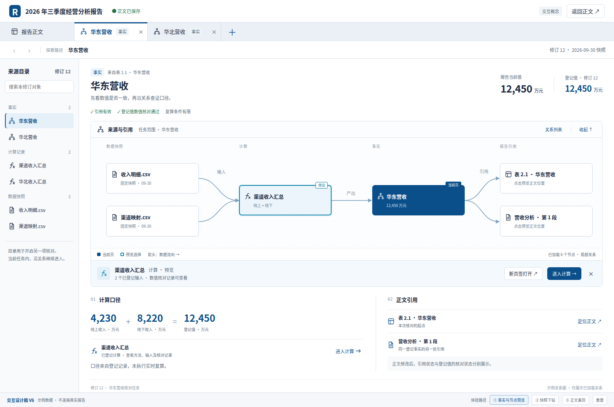
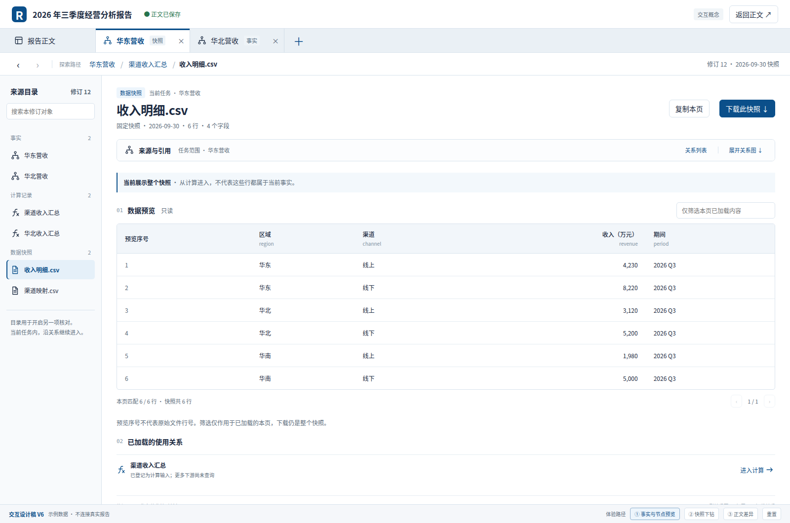
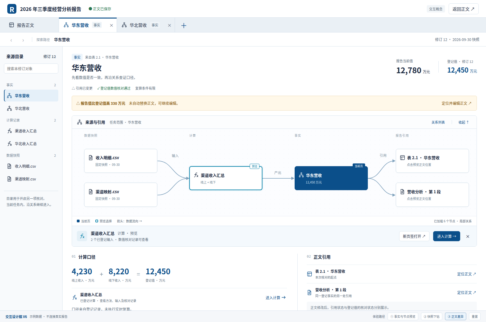
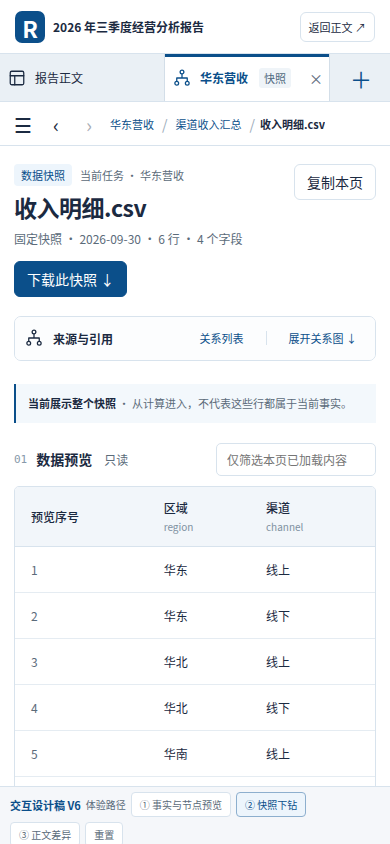

# 证据浏览器 v6：导航、关系预览与核对现场

> 2026-10-01 · 基于 v5 的细化设计与可点击原型
>
> 保留白底企业蓝主题、任务页签、探索面包屑与 graph。设计原型与正式实现的进度分别记录；报表主题未修改。

当前工程验收以 [逐项验收清单](acceptance.md) 为准。下方推进记录按时间保留，早期“尚缺”列不代表最新状态；v6 尚未全部完成。

最新阶段检查点（2026-10-03）：在 `8d4ac1d` 基础上复用 d3fc 四轮交替方向排布、节点图标区域碰撞评分与小图标签内边距压缩，保留全部名称及默认3D/可切换2D。指定9节点竖屏、15节点横屏截图改善，但仍有名称/图标遮挡；27张小图截图的边界、身份、溢出与脚本错误检查，以及初始视角/重建恢复、构建/预算检查通过，不能据此判定全图可读性通过。最新截图后缀为 `-stable`。

此前清除悬停后点按失败已进一步诊断：原生指针状态已清空，释放与悬停坐标一致，但静止坐标反复命中/失去命中；日志显示文字与尺寸不变，标签锚点上下切换，相机阻尼末尾的亚像素浮点变化影响组件布局评分。布局输入现取整到CSS像素，实际节点/相机与引导线端点仍沿用原投影。新增静止悬停画布逐像素断言在修正前失败、修正后通过，清除悬停后触控点按及原手势/导航/恢复检查通过。无效的重新拾取试验已撤回，临时诊断已清理。后续继续全图遮挡、复杂图与真实业务验证；真机与辅助技术验收按用户要求暂缓。

## 2D/3D 关系图设计与推进计划（2026-10-03）

小图固定障碍与投影验收推进（2026-10-03）：d3fc原greedy会移动图标障碍矩形，而应用只移动名称；组件还可能按越界候选评分，应用裁回后再产生重叠。新增ESM小补丁使 `fixed` 矩形只参与原生评分，并将初始/候选名称位置约束到视口后评分，继续复用原算法。名称在关注对象优先后按屏幕从下到上输入，使用12轮交替镜像与24px图标留白；相同量化投影、名称尺寸/身份和视口下缓存布局，节点/相机与全部名称保留，默认3D/2D契约不变。

随后的小图候选将镜像排布扩展为16轮（末4轮加入单轴镜像），固定图标留白调整为28px。修正投影统计排除名称与其自身图标的正常锚点相交后，真实27场景回放显示名称重叠2对、不同节点图标覆盖20处；5/9节点全部视口仍为0，15节点横屏三角度名称覆盖为0、1、0对，手机竖屏不同节点图标覆盖为7、8、5处。该结果仍是有限角度证据，整体可读性未通过。

小图引导线视觉微调：保留现有连接关系和交互，仅将 SVG 引导线改为更浅的 `#b8cbd5`、0.55px、`2 4` 虚线，降低中心节点簇的视觉噪声；构建与预算检查通过。

2D/3D 追踪语义对齐：2D 追踪选择器补齐“只看预览对象的直接关系”选项，切换后高亮与 3D 相同的预览直接边，并可往返切回 3D；真实 3D fixture 回放覆盖该往返和高亮断言。

2D 预览适应视图对齐：选择“只看预览对象的直接关系”后，2D 的“适应预览”现在将当前对象、直接关系端点及对应路径一起纳入边界计算，避免仍按整图适应；fixture 已覆盖按钮语义和执行。

最终鼠标回放通过模式切换、预览/追踪/分支重试/导航、单击/双击、后台打开与任务复用、旋转/滚轮、相机操作及减少动态效果，无脚本错误。

新增实际Sprite投影检查：测试包装并继续调用原生raycast，从实际矩阵/锚点/尺寸计算名称区域与14px图标区域的相交，不以应用布局输出代替答案；完整几何和重叠对象对写入 `output/report-editor-v6-small-3d-ordered-geometry.json`，27张截图使用 `-ordered` 后缀。最终指定5/9节点三视口与15节点桌面/竖屏名称间重叠为0，15节点横屏三角度各保留1对；9节点竖屏图标覆盖为1～4处、15节点竖屏为8～13处，15节点横屏为0～4处（按矩形相交面积大于1px²计数，包含标签背景）。代表截图已检查，整体可读性仍未通过；这些有限投影结果不保证任意角度或更大图。

固定区域/输入不变与边界3项定向测试通过，撤回补丁时2项失败；补丁从原依赖无fuzz重施通过，构建/预算、初始隐藏挂载/用户缩放/重建逐像素恢复、触控悬停稳定性/点按/手势/导航/恢复通过。后续继续名称/图标遮挡、复杂图、2D共用通道及真实后端验证；真机/读屏仍暂缓，未重复完整测试。

本阶段最终定向验证：触控模拟两次通过新增稳定性/点按检查及原旋转、捏合、导航、适应恢复、节点起点手势不误预览与逐像素恢复；鼠标回放通过单/双击、后台打开、模式切换、关系追踪、分支重试、导航、旋转/滚轮及减少动态效果。27张小图截图、初始视角/重建恢复、构建/预算与差异/脚本语法检查通过，未重复完整测试。

3D小图名称推进（2026-10-03）：沿用已有15节点名称显示阈值，阈值内的可见名称复用SpriteText固定12px与两行紧凑文字，避免未关注名称随透视变成小字；大图继续重点名称策略。小图未固定追踪时，根据组件原生屏幕坐标选择最近可见节点，复用Sprite锚点向上下外侧展开，不移动节点；已固定追踪仍优先按两端定位。首次竖屏试验复现两标签重叠，最终三节点截图已分开且事实名称不再缩成小字。重建严格比较又复现当前页标签锚点丢失，现布局就绪及原生tick/stop更新标签，恢复画面逐像素一致。initial fixture保留放大与重建前后PNG作为诊断。最终initial、长名称39/55三视口及生命周期6轮44上下文回放通过，构建/预算通过，未重复完整测试。截图仅证明指定三/四节点场景，未完成5～15节点及任意角度的标签避让矩阵，密集图整体可读性仍未完成；真机/读屏暂不处理。

3D首次可见视图推进（2026-10-03）：此前默认相机距离由组件按节点数量立方根×170估算，现无历史视角的新页面在布局就绪且容器首次非零可见后调用原生zoomToFit一次，使用既有范围/标签留白、零时长初始化；收起挂载等待展开，隐藏时不计算。已有运行期视角、列表往返、预览重建及后退不重新初始化。新增evidence-3d-initial-fixture.mjs在1280/390px先收起挂载再打开，不手动调整相机便保存初始截图；真实像素核对图形上下不触边，指定三节点画面占用高度分别至少45%/20%。这些阈值只用于该固定样例回归，不是通用图布局指标。随后手动适应并放大，列表往返与预览/关闭重建后画布逐像素一致，未覆盖用户缩放；最终长名称39/55三视口历史/模式/边界回放通过，无脚本错误，构建及预算通过，未运行完整测试。首轮误要求初始布局与稍后手动适应像素相同，因布局继续收敛失败，改为核对初始范围并严格验证已缓存现场；移动脚本补齐目录展开入口后通过。桌面初始画面改善明显，竖屏仍有小节点/名称，不能标记整体可读性通过，真机/读屏暂不处理。

3D类型辨认推进（2026-10-03）：未选中球体按现有业务类型配色（事实蓝、计算紫、快照绿、图表赭、引用灰），Lucide图标同步类型色；当前页/预览球体仍用深蓝/青色，追踪的无关球体仍淡化。复用组件nodeColor，不改变身份、登记边、坐标或拾取。原图例改为已加载节点数/局部关系、当前已加载类型色块与状态色说明，完整局部范围/名称操作提示保留title；文字类型和图标形状继续保留，不只靠颜色识别。四类型小图最终浏览器检查与截图已完成，鼠标fixture新增初始三个类型及追加快照后图例断言；原鼠标行为回放通过。最终构建和资源预算通过，未执行完整测试。39/55长名称三视口图例与窄屏截图已检查，整体复杂图仍密集；图表类型与全部状态颜色视觉矩阵未覆盖，不标记整体可读性通过，真机/读屏继续暂不处理。

3D文字对比度推进（2026-10-03）：源码核对确认three-spritetext本身已为每次生成的CanvasTexture设置sRGB，上一轮对文字map的重复赋值并非偏灰根因，已移除；Lucide图标纹理仍需原sRGB设置。名称改用组件fontWeight=600，文字与图标使用Three原生depthWrite=false、toneMapped=false，避免透明底图写入深度并固定信息颜色。12px目标字号、两行/省略、预览身份、已加载关系数与图标可见规则保持。普通/长名称39/55三视口回放通过全图/追踪/旋转/缩放边界、名称/列表往返严格像素一致及导航恢复，最终构建和资源预算通过，未运行完整测试。长名称竖屏追踪前后、桌面概览截图已检查：字重改善辨认，但密集投影与连线靠近标签仍存在，不宣称透明遮挡全部解决或整体可读性通过。真机/读屏继续暂不处理。

3D旋转适应范围推进（2026-10-03）：真实投影诊断与源码核对确认，原组件先合并全部几何为世界坐标大盒，再适应大盒八个角点，斜向视图为未占用的组合角点留出空间。现通过两份ESM补丁保留各几何盒角点，沿用组件原相机距离公式、中心及标签留白；无corners的普通盒仍走原八角点，不改业务身份、坐标缓存或相机控制器。候选点数量随图增长，距离计算使用reduce避免展开成函数参数。指定39/55长名称旋转回放的节点投影高度如下；两次运行坐标略有差异，数值用于描述代表场景改善，不作为全部视角保证。

| 页面视口 | 画布尺寸 | 原适应后的节点投影高 | 按各几何盒适应后的节点投影高 |
| --- | --- | --- | --- |
| 1280×900 | 1024×522 | 约197px | 约327px |
| 390×844 | 388×277 | 约63px | 约90px |
| 844×390 | 572×184 | 约32px | 约52px |

最终普通/超长39/55回放通过新增全图边界像素检查及原追踪/直接关系、名称/列表往返、三视口和导航检查；最终鼠标回放通过单击/双击、背景打开、相机操作和偏好，无脚本错误。三视口长名称概览及竖屏前后截图已检查。两份补丁从原始依赖重应用通过，最终构建/资源预算及差异/语法检查通过，临时投影诊断已移除，未运行完整测试。桌面整体大小改善，窄屏节点仍小、投影仍密集，不标记整体可读性通过；真机/读屏继续暂不处理。

3D节点信息推进（2026-10-03）：补齐与2D同源的Lucide类型图标，使用Three原生Sprite/Group与TextureLoader，不新增依赖或拾取器；图标按名称可见范围显示、保持14px屏幕尺寸，不参与射线拾取。名称增加当前已登记边数（自引用只计一次），分支加载/失败时显示对应状态，完整悬停文字包含类型、名称与状态。关注名称保持两行与原12px目标，图标和文字纹理采用原生sRGB色彩空间；不是完整血缘计数。动态加载入口只导出所需Three类型，避免直接动态导入整个命名空间保留无关导出；最终共享Three与原生类型两块合计约565KiB，既有单块预算均通过，未提高预算。普通/超长39/55三视口及生命周期/触控回放通过，指定竖屏、横屏追踪及小图截图已检查；小图回放新增原生fillText记录并继续调用原方法，核对关系信息实际进入文字纹理。该证据不覆盖所有五种类型的视觉矩阵、全部角度或真实后端规模性能；未关注名称仍小，整体概览可读性保留未完成，真机/读屏暂不处理。

工具栏紧凑化推进（2026-10-03）：模式切换缩为2D/3D目标名称，重置复用Lucide RotateCcw，3D适应复用原Expand按钮并按追踪范围更新aria-label/title；保留现有原生按钮与操作逻辑。390px七个图操作按钮现保持一行、目标均至少40px，长名称预览时画布至少270px（此前截图约一行按钮空间被换行占用）。普通/长名称39/55三视口回放通过新增尺寸断言及原关系/追踪/历史/列表检查；长名称竖屏、横屏和桌面截图已检查，模拟触控回放通过。5项受影响定向测试通过，模式测试改为核对操作名称与提示，未将缩短的可见文案作为导航契约。诊断发现组件确会纳入隐藏几何，但当前样例包围范围与节点范围接近，未证明其造成当前概览过小，故未引入组件补丁；临时诊断代码已移除。此轮改善工具占用，不宣称复杂图整体可读性通过；真机/读屏继续暂不处理。

按用户要求保留 2D 和真实 3D 两种关系图，默认 3D，工具栏允许切换；两种模式共用节点身份、登记关系、预览与导航状态，不因显示模式改变业务数据。无 WebGL 时回退到 2D。

组件优先复用成熟开源实现：3D 使用 [3d-force-graph](https://github.com/vasturiano/3d-force-graph)，常驻名称使用 [three-spritetext](https://github.com/vasturiano/three-spritetext)；2D 保留现有 Dagre + SVG。3D 资源按需加载，不自研渲染器或相机控制器。v6 原型中的 2D 布局继续作为 2D 参考，不作为 3D 效果验收证据。

| 阶段 | 当前状态与验收依据 |
| --- | --- |
| 双模式与容器适配 | 已实现默认 3D、模式切换、尺寸同步与销毁；Chromium WebGL 的 1280px/390px 回放已有证据。 |
| 名称、预览与导航 | 已实现常驻标签、共用预览操作、分支重试、选择器 Enter/Escape 与焦点恢复；小图浏览器回放已有证据。当前页/预览/悬停标签复用固定12px与两行紧凑文字；当前与预览按屏幕上下位置向外展开，复杂图缩小概览及小图悬停代表截图已检查。未关注节点名称仍偏小。 |
| 视角与现场保持 | 已实现运行期相机/节点坐标缓存，以及缩放、定位当前对象和重置；小图截图与指定操作回放已有证据。按钮相机动画统一180ms，减少动态效果时为0；Chromium回放在普通/减少偏好下检查五种操作后的画面稳定性。 |
| 关系追踪 | 已实现已加载端点选择、登记边高亮与两端适应视图；固定端点时仅显示两端及对应关系，取消恢复全图，数据/坐标保留。追踪标签使用组件固定字号与两行文字：类型/状态一行，名称最多14字并省略；全名保留在选择器、摘要和悬停提示。39/55普通/超长中文样例的1280px、390px、844px横屏及缩小回放通过，边界像素与截图确认指定标签未被画布裁切，追踪/取消与导航保持。任意角度及整体概览仍待验证。 |
| 复杂图与直接交互 | Chromium WebGL 小图已有真实鼠标悬停、空白旋转、滚轮缩放、旋转/缩放后画布单击预览、双击进入与后退恢复证据。3D 单击等待350ms区分双击，避免预览重建画布吞掉第二次点击。390px模拟触控已有空白旋转、捏合、双指转单指、快速轻触预览/导航及适应恢复证据，组件拾取节流竞态已补丁修复。四节点的节点起点捏合/转单指回放通过，禁用组件默认节点拖拽后相同视角前后截图完全一致。新增39/55共享输入、环、自引用、多批次加载、模式一致及进入/后退回放；使用组件力布局间距/预热和自引用/双向曲线，全图名称仍偏小且有遮挡，整体可读性、其余鼠标及触摸组合待验收。 |
| 真机与辅助技术 | iPhone/Android 真机、Safari/VoiceOver、NVDA/Orca 按用户要求暂不处理，不作为本阶段阻塞，仍不标记为通过。 |

后续依次验证关系追踪、复杂图可读性与画布交互，并将结果写入逐项验收清单。当前是阶段性交付，不能据小图回放宣称 v6 全部完成。

计划同步（2026-10-03）：[总实施计划的双模式追加计划](../../specs/2026-09-29-report-editor-data-lineage-batched-implementation.md) 已纳入默认3D、成熟组件复用、现有证据与后续验收顺序。移动独立图视图内切换文字列表已补齐指定fixture证据，详见下方记录；2D共用通道与3D整体概览可读性继续保留未完成，真机/读屏按用户要求暂不处理。

移动独立视图文字入口推进（2026-10-03）：原移动图视图隐藏列表切换并强制显示画布，现保留已有切换按钮，列表在独立视图内部滚动；打开“关系图”入口明确切到图，返回详情沿用原收起状态及焦点恢复。1项受影响定向测试、TypeScript/Vite构建和资源预算通过。普通/超长39节点55边Chromium WebGL回放均通过三视口及原追踪/导航检查，390×844与844×390新增列表55条、内部滚动、画布隐藏、返回详情入口可见、无整页横向溢出及列表往返画布逐像素一致；两种长名称移动列表截图已检查，无脚本错误。未重复完整测试。此证据限于指定fixture与模拟视口，不替代全业务关系、真机或读屏验收；复杂图整体可读性仍未完成。

3D追踪现场恢复推进（2026-10-03）：原追踪选择只在组件局部变量，重建/后退丢失。现将3D选择和预览身份存入当前历史页graph3dTrace；恢复时要求预览身份匹配，固定端点仍为已加载邻居，直接关系范围仍有可用邻居，否则回全图。新页面或更换预览不套用旧端点，2D不使用该3D字段。普通/超长39/55fixture通过直接关系与固定端点两类Enter导航/后退、2D/3D往返恢复以及更换预览清除旧选择；既有三视口/关系一致/边界/导航回放通过，无脚本错误。构建/预算、差异/语法检查通过，未执行完整测试。图坐标和相机仍为原运行期缓存，新增选择持久字段不代表整图跨刷新恢复或任意旧数据迁移已验收；整体可读性继续推进，真机/读屏暂不处理。

3D直接关系视图推进（2026-10-03）：现有端点选择器增加“只看预览对象的直接关系”，复用组件nodeVisibility/linkVisibility，仅显示预览与已登记相邻节点及直接边；包含自引用，保留全部节点身份/坐标、全图入口及单对端点追踪。过滤不自动移动相机，主动“适应预览”使用组件zoomToFit按可见节点适应，完整含义放title避免横屏工具栏挤压。普通/超长39/55回放通过15条直接登记关系、40个节点选择项保持、过滤实际画面变化/返回全图像素一致、直接关系与单对追踪切换、三视口边界和预览/历史保持；最终长名称及触控回归、构建/预算通过，代表截图已检查。最终长名称首轮在名称开关之前基线稳定检查失败，旋转后适应观察窗口从250ms统一为650ms后通过，严格像素断言未放宽；仅支持观察时序影响，不宣称所有偶发差异根因确定。局部无关连线减少，窄屏节点仍小，整体可读性继续保留未完成，真机/读屏暂不处理。

3D名称差异诊断补充（2026-10-03）：针对上轮一次未定位的像素差异，复杂fixture新增REPORT_EDITOR_LABEL_CYCLES（默认1，诊断最多10轮）与失败像素报告。普通/超长样例并行运行，各三视口每处3轮，共18轮，基线150ms稳定、前后悬停身份、开关实际改变画面、往返PNG完全一致均通过，既有列表/旋转/边界/导航检查通过。诊断轮次前后PNG分别保存，失败时输出变化像素数、最大色差及范围（尺寸变化另报）；不替换或放宽断言。本轮未复现原差异，原因仍未知，不据此标记问题已修复或整体可读性通过。仅回放/文档变更，语法/差异检查通过，未重新构建或重复完整测试；下一步转回复杂图布局与可读性，有新症状再用诊断数据定位。

3D隐藏绘制与关系列表推进（2026-10-03）：真实WebGL绘制计数先复现切到文字列表后隐藏画布在150ms内仍绘制90次。现用现有ResizeObserver随可见尺寸调用组件pauseAnimation/resumeAnimation，不销毁隐藏现场或自建动画循环。生命周期fixture最终验证列表/收起后两次150ms采样间绘制数不变，返回图/展开后恢复绘制，既有6轮上下文/导航/关闭检查继续通过。复杂3D普通/超长39/55回放新增文字列表与2D累计图的55条有序端点多重集一致、列表往返后预览及画布逐像素一致。并发长名称回放首次在后续名称开关比较出现一次差异，单独重跑并增加开关前画面稳定断言后通过，原因未确定，不宣称全部时序已排除。构建/预算、差异/脚本语法通过，未重复完整测试；复杂图整体可读性继续推进，真机/辅助技术暂不处理。

3D上下文释放推进（2026-10-03）：组件_destructor已dispose材质/纹理/渲染器，但未主动丢弃WebGL上下文；每次挂载的能力探针也创建临时上下文。现探针检查后使用WEBGL_lose_context释放，移除实例在组件析构后调用Three原生forceContextLoss，保留先缓存相机/坐标的顺序。新增生命周期fixture主动保留上下文引用以验证确定释放，原版首次打开有2个活跃上下文而失败；修复后6轮预览/关闭、2D/3D往返及进入/后退/任务关闭通过，44个累计上下文中仅可见实例保留1个，2D与关闭后为0，无上下文过多告警/脚本错误。触控回归、构建/预算与差异/语法检查通过。该探针不测量自然GC、系统内存或GPU性能，也不能据原版结果宣称自然运行内存泄漏；释放依赖浏览器支持原生扩展，未支持时仍保留组件dispose。整体复杂图可读性继续推进，真机/读屏暂不处理。

3D鼠标辅助打开推进（2026-10-03）：按原设计补齐图节点中键后台开任务。组件原ESM入口仅转发左键/右键，真实画布中键回放先失败；现扩展已有patch-package补丁，把非拖动中键交给同一原生拾取/回调，应用按event.button接入既有后台任务逻辑，并阻止auxclick浏览器默认动作。最终真实画布回放通过中键独立创建后台任务，Ctrl/Meta/右键重复打开复用、原标题/预览/历史保持及清空悬停后画布完全一致；Ctrl+Shift前台激活已有任务，再返回原任务保持预览。修饰键使用真实键盘down/up，不把mouse.click不支持的modifiers参数当作证据。单击/双击、旋转/滚轮、分支/导航、相机偏好及现有触控fixture回归通过；补丁从原依赖重应用、构建/预算和差异检查通过。仅Chromium/Linux模拟Meta键证据，不作为macOS原生⌘或全部中键拖动行为验收。复杂图整体可读性仍继续推进，设备/读屏暂不处理。

3D密集名称显示推进（2026-10-03）：超过15个已加载节点时默认只显示当前页、预览和悬停名称，工具栏使用Lucide名称图标切换全部/重点，按下状态与提示说明当前选择；小图仍默认全部名称。仅改变已有Sprite的可见性与原生拾取图层，不隐藏球体或登记关系；全部对象继续在选择器和文字列表中可访问。偏好保存于当前页面，后退恢复非默认选择。统一所有概览名称为10px的试验因标签严重叠压已撤回，当前不使用该方案。普通/超长39/55复杂回放最终通过三视口、名称切换实际画面差异、统一清空悬停后开关往返像素一致、后退偏好及既有旋转/边界/导航检查；横屏图标工具栏和长名称竖屏代表截图已检查，状态19项、构建/预算通过。概览文字遮挡减少，但远处节点仍小、三维投影密集，整体可读性仍未完成。15仅为名称默认显示阈值，不是规模上限或性能验收阈值；真机/读屏继续暂不处理。

3D关注对象可读性推进（2026-10-03）：概览中当前页、预览及悬停名称保持12px目标字号，复用SpriteText多行文字和原生锚点；当前/预览与追踪两端按实际屏幕上下位置向外展开，随组件相机变化更新，避免旋转后向内重叠。新增角度回放先复现固定文字触边，现把标签屏幕范围纳入组件zoomToFit留白。普通/超长中文39/55回放通过三种视口的缩小概览及各三个旋转角度边界检查，代表截图已检查；鼠标/触控定向回归、构建/预算通过。全图未关注名称仍偏小、关系仍密集，整体可读性保留未完成；指定角度证据不等于所有视角通过。设备/读屏仍暂不处理。

3D节点起点触控推进（2026-10-03）：复现组件默认节点拖拽导致捏合时布局被改变，改为原生`enableNodeDrag(false)`，关系浏览只改变相机。390px四节点模拟回放通过节点起点双指缩放及转单指继续旋转、不误预览，相同重置/适应视角前后画布逐像素一致，截图已检查。快速轻触和既有鼠标/导航回归、构建/预算通过；复杂图可读性与其余手势范围仍待推进，真机/辅助技术暂不处理。

3D模拟触控推进（2026-10-03）：390×844 Chromium触摸输入回放通过空白单指旋转、双指缩放、双指转单指、快速轻触预览/进入/后退及放大后适应恢复；保持标题/历史/窗口滚动，无误预览和脚本异常。快速轻触先复现组件50ms命中节流竞态，使用成熟patch-package对three-render-objects@1.43.0实际ESM入口做最小修补，点击前刷新命中；不自研手势或拾取器。构建、资源预算和补丁重应用检查通过，指定截图已检查。全图名称仍偏小，节点起点手势及任意角度可读性待验证；真机/辅助技术仍暂不处理。详见验收清单与smoke回放说明。

追踪关系适应视图（2026-10-02）：固定预览端点后，既有“适应”动作改为“适应追踪关系”，使用两端节点边界与实际登记路径范围计算缩放和平移；未固定端点时保持原全图适应动作。仅用户主动点击时改变视口，不移动节点或改预览/导航；切回全部关系恢复按钮说明。1项扩展追踪定向测试通过两端边界和状态稳定；39/55 Chromium回放按实际节点屏幕边界、SVG路径每4px采样确认390px画布内同时可见两端和连线，保持原坐标、预览身份、0重叠/0穿节点及353共线对，后续导航/文字列表/横屏回放通过。移动截图已检查，构建/预算、差异和脚本语法检查通过，未重复完整测试。长距离关系缩小后节点文字仍小，完整对象名由端点选择和预览摘要提供；该局部关系可见性证据不替代密集图整体概览、真机或辅助技术验收。

窄屏端点追踪（2026-10-02）：关系图工具栏新增原生端点选择，按当前预览的已加载相邻节点列出选项；选择后仅突出两端登记边，切回“全部预览关系”恢复，不改变预览身份、坐标或导航。未预览时禁用，390px占独立一行且高度40px，横屏继续单行，保留199px画布。1项扩展追踪定向测试及最终39/55复杂Chromium回放通过端点选择、实际方向键恢复、预览/坐标稳定和控件边界；独立图视图移动截图已检查，0重叠/0穿节点、353共线对保持。长名称分支回放发现此前150px留白使预览增高挤压画布，恢复210px预留（不超过40vh）后未选中/选中/失败/加载/完成五状态高度一致，重试与焦点恢复通过。最终构建与预算通过，文案晚于首轮构建，已重新构建并确认页面包含“追踪：”提示；差异与脚本语法检查通过。原生选择器的手机触摸体验、密集图整体概览及辅助技术仍待验收，未重复完整测试。

图节点信息补齐（2026-10-02）：逐项审查发现原设计要求的类型图标与一行关键信息尚未落地；现复用Lucide的事实/计算/快照/图表/引用图标，名称独立单行，说明显示类型与“已加载N条关系”，分支加载/失败时替换该说明，不追加多行字段。节点仍为170×76，业务边、导航和已有坐标不变。新增节点断言及原追踪定向测试2项通过；39节点/55边复杂Chromium回放验证全部节点图标、已加载边计数与内容边界，保持0重叠/0穿节点、1400×1178和353共线对，桌面追踪及390px截图已检查；构建、预算、脚本语法与差异检查通过。计数仅指已加载关系，不冒充完整血缘；密集图全局概览、移动真机和辅助技术仍未完成，未重复完整测试。

空态与筛选恢复（2026-10-02）：空快照明确显示“此快照没有数据行”，筛选零匹配明确说明仅本页无匹配并提供“清除筛选”；清除恢复当前页行与搜索框焦点，不导航、不改变分页。空态放在表格外，避免计入复制数据；使用独立样式类与status语义，不覆盖原下载反馈。5项筛选/复制/下载定向测试通过，复制fixture四次回读通过，最终1280px/390px详情九状态回放通过（含清除、焦点及空态隐藏），两张移动空态截图已检查。初版复用下载说明类导致回放定位不唯一，独立类名后复核通过；生产构建、预算和差异检查通过。该批不替代真实登记/授权、真机或辅助技术验收，未重复完整测试。

详情页美化与操作反馈（2026-10-02）：证据工作区统一白底，标题、登记值、三项核对状态与说明分层；长计算参数可换行，数据表边框贴合内容并在窄屏内部横向滚动。筛选、分页和复制/下载分区，移动操作目标至少40px，分页/操作区补充分组名称，复制与下载反馈使用status语义。Chromium固定接口回放在1280px/390px通过告警、长参数、数据、零匹配、分页失败、下载拒绝、空快照、加载和加载失败九种状态，检查无整页/工作区横向溢出、失败保留原行与可重试；复制四次回读及计算输出导航回放通过。本批构建与预算通过（证据浏览器约129.5KiB），代表桌面表格、移动下载拒绝、空快照与失败截图已检查。该证据不替代真实授权、移动真机或辅助技术验收；密集关系图整体可读性仍需推进，未重复完整测试。

窄屏视觉复核（2026-10-02）：39 节点/55 边 fixture 在 844×390 横屏发现独立图视图退出全屏、画布落到首屏以下。现保持全屏关系区，图与预览并排；390×844 竖屏预览条收紧固定留白，让出更多画布。Chromium 回放检查横屏图可见高度 199px、预览侧栏与返回详情、竖屏图/预览、无整页横向溢出；生产构建、预算和差异检查通过。截图为桌面视口模拟，不代替真机横屏或复杂图整体可读性验收。

详情视觉收口（2026-10-02）：计算/预处理参数区保留原始格式，超长值改为区块内横向滚动，并提供可聚焦的滚动区域，避免窄屏逐字折行撑高详情；表格容器移除稳定滚动条预留，边界贴合实际表格。详情 fixture 的 1280px/390px 九种状态回放通过，构建、预算与差异检查通过。

最新高扇出通道分散（2026-10-02）：只对需要 A* 避障的高扇出边，按稳定端口槽位把节点外侧引线分到三条网格通道；仍通过现有节点/引线避障检查，未改业务边或已有节点坐标。图模块 11 项测试通过，新增断言确认同一侧端口使用多个外伸通道；39 节点/55 边 Chromium 回放保持 1400×1178、0 节点重叠、0 非端点穿线、导航与图/文字列表一致，共线通道对由基线 488、四通道的 375 降至 353；五通道试验为 389，已撤回。完整布局和产品视口截图已检查，左侧仍有 `y=396` 的密集热点（76 对），不认定整体可读性通过。真实授权/索引/HTTP 的 301 节点/300 边高扇出 Chromium 定向回放通过，单次观察加载约 1.723 秒、预览约 0.544 秒；该耗时不作为跨设备性能保证。生产构建与资源预算通过，未引入新依赖或重复完整测试。

2026-10-02 用户补充：将视觉美化和交互体验优化纳入完成范围。具体工作项与验收依据见 [美化与交互优化计划](acceptance.md#美化与交互优化计划2026-10-02-补充)，按图可读性与节点细节、预览条/工具栏、对象详情与数据操作、导航和窄屏整体审查的顺序推进。

最新 UI 细节收口（2026-10-02）：关系图缩放/定位按钮和预览条进入、新页签、关闭、加载关系动作复用现有 Lucide 图标；工具栏使用浅色操作带，预览摘要、动作、状态分层，状态行保留稳定高度；告警收窄为左侧色条，关系区改为连续内容带，手机端状态行使用稳定两列。证据页 57 项定向测试、TypeScript、生产构建与资源预算通过；未新增组件库或第三方依赖。该轮改善指定页面层级，不代表复杂图全局可读性、真机或辅助技术验收完成。

最新关系图视觉权重调整（2026-10-02）：普通连线改为更浅、更细并降低默认不透明度，未追踪关系退到背景；预览/追踪边保持高对比，画布增加稳定的浅色底层以区分节点、连线和操作区。未改布局、数据或导航契约。关系图/关系数据定向测试 20 项通过，生产构建、预算和 39 节点/55 边 Chromium 回放通过，0 节点重叠、0 穿节点、共线路段对 488；截图已检查。该调整改善局部辨识度，但不能替代复杂图全局可读性、真机或辅助技术验收。

最新关系图概览动作（2026-10-02）：工具栏新增 Lucide `Expand` 图标的“适应关系图”，按当前图视口宽度收缩宽画布并清除平移/滚动，不改变节点坐标、预览、导航历史或业务关系；缩放下限允许适应窄视口所需的比例，避免右侧节点被裁切；保留缩放、重置和定位动作。对象页定向测试 57 项通过，生产构建与预算通过。Chromium 390px 导航 fixture 新增实际点击、全部节点位于视口内、预览、Esc、返回详情、焦点恢复和整页无横向溢出断言，fit 截图 `output/report-editor-v6-mobile-graph-fit.png` 已检查；复杂图完整截图已检查，宽图可在桌面视口先获得整体横向概览；纵向细节仍需滚动，不能替代复杂图全局可读性、真机或辅助技术验收。

复杂图适应视图复核（2026-10-02）：39 节点/55 边的 Chromium fixture 新增实际点击“适应关系图”并检查全部节点的横向屏幕边界，再重置视图继续原有移动预览/定位流程；回放通过，0 节点重叠、0 非端点穿线，共线通道对保持 488，且图/文字列表端点一致。产品视口截图 `output/report-editor-v6-complex-graph-fit.png` 已检查：横向可见全部节点，但画布仍需纵向滚动，左侧共享通道仍密；因此复杂图整体可读性继续判为未通过，截图不冒充全图可读性或真实设备证据。

复杂图通道热点测量（2026-10-02）：39/55 回放额外输出共线热点，最高集中在 `y=396`（116 对）与 `x=204`（101 对）。尝试将新增批次 `ranksep` 从 64 提高到 96 后，画布宽度由 1400 增至 1528、共线对由 488 增至 569，已撤回该参数；该结果说明单纯拉大层间距不能解决共享通道，后续应针对具体批次/端口路由设计，不扩大为布局完成证据。

共享通道重路由实验（2026-10-02）：尝试把共线边直接纳入 A* 待重路由集合时，定向回归发现新增关系会改变此前已加载边的路径（违反位置/路径稳定契约），已撤回。当前仍只对穿节点边重路由；热点测量保留用于后续在不重排旧路径的前提下设计新边专用通道。

新增边专用通道实验（2026-10-02）：保持旧边路径锁定，只对新边共线段启用现有 A* 重路由；新增无障碍平行边回归与原有图/页面定向测试通过，但 39/55 图共线对由基线 488 升至 558。缩窄为“仅避让此前已加载的旧边”后仍为 497，左侧热点未消失。两种变体均已撤回，专属实验测试也移除；重新构建并通过预算、11 项图测试及同一 39/55 Chromium 回放，确认基线恢复至 1400×1178、488 对共线、0 节点重叠、0 非端点穿线。后续需改变通道分配策略，不能仅扩大 A* 待重路由集合。

最新关系列表细节（2026-10-02）：复用既有关系分组、端点和方向语义，分组改为轻量小标题，端点入口改为行内链接式按钮，分隔和键盘焦点保持；关系/页面定向测试共 66 项通过。该轮未改变关系数据或导航契约，复杂图全局可读性和设备矩阵仍未完成。

最新任务页签细节（2026-10-02）：任务关闭入口复用 Lucide `X` 图标，保留原有 aria-label、关闭行为和键盘焦点；浏览器状态测试 19 项、TypeScript、生产构建和资源预算通过。未新增依赖，真机与辅助技术验收仍按清单保留。

最新探索导航细节（2026-10-02）：后退、前进和完整路径入口统一使用 Lucide 箭头/MoreHorizontal 图标，去除裸字符控件，保留原生导航、`details` 展开、aria-label 与焦点样式。浏览器状态测试 19 项、生产构建和资源预算通过；未新增依赖。

最新关系追踪交互（2026-10-02）：图节点支持鼠标悬停与键盘聚焦的临时追踪。已有预览时，相邻节点只突出两端之间的登记关系；未预览时突出该节点的登记关系。其他边淡化，追踪边/箭头提到上层；离开后恢复，触摸指针不模拟悬停。无关节点焦点不会覆盖当前预览，保持坐标、标题、预览身份与历史。2项定向测试通过；单测容器未接入document时原生focus不触发，修正为事件级验证，原生输入由正式浏览器回放覆盖。39/55复杂Chromium回放验证鼠标1条关系、键盘2条双向关系、其余边实际opacity=0.12、截图后的追踪身份、坐标和导航/列表一致；1400×1178px/488通道测量保持。截图先定位关系容器再悬停，避免截图滚动重置鼠标命中；hover/focus及390px截图已检查。最终构建、预算（约129.3KiB）和Chromium键盘流程通过，触控沿用本批既有手势回放通过记录；未重复完整测试。单条/双向关系追踪更清楚，但密集图全局概览、移动触控追踪体验、详情美化及真机/辅助技术继续保留为未完成。

最新增量通道修复（2026-10-02）：新增回归复现分批加入的两种关系完全复用已有绕行路径；原通道网格只记本轮待修复边，没有记录此前已安全加载的边。使用现有pathfinding的expandPath把安全路径映射到优先通道网格，新边先避让旧边中间通道，端口可共享，无路仍退回节点避障网格；旧安全路径不重排。新增回归先失败、修复后11项受影响图测试通过。最终生产构建与预算通过（证据浏览器约128.5KiB）；39/55复杂Chromium回放保持1400×1178px、0重叠/0穿节点、既有坐标稳定、图/列表一致和导航，共线路段对509→488。完整图截图已检查，部分通道分开，但左侧共享关系仍密集，整体可读性继续未通过。真实12共享输入small定向用例通过（15节点/26边，1 passed），禁用此前记录的无关pytest-playwright/base-url插件，未重跑完整矩阵。后续继续改善关系追踪与详情体验，真机/辅助技术仍保留证据缺口。

最新预览条与工具栏优化（2026-10-02）：预览按摘要、操作、状态分区，“进入”复用现有主按钮样式，加载/失败说明独立显示；状态行预留空间，窄屏预览条预留高度并限制为视口40%以内、超长内容可内部滚动。补齐当前页/预览图例色块、缩放按钮提示与窄屏40px按钮。扩展branch fixture长计算名称模式，以固定来源响应在1280px/390px验证未选择、预览、完整性失败、加载、完成五种状态：按钮完整可见且不重叠、移动画布高度保持一致、节点坐标/标题/历史保持、重试成功及关闭焦点恢复，页面无脚本错误/整页溢出。初版截图发现状态行隐藏引起一行高度跳动，预留空间后正式回放通过。7项受影响页面/手势定向测试、最终生产构建与预算（证据浏览器约128.2KiB）、Chromium键盘/触控模拟回放通过，代表桌面与移动截图已检查；未运行完整测试。命令与截图路径见frontend/smoke/README.md。本批补齐指定布局体验证据，复杂图整体可读性、对象详情与数据操作美化、真机及辅助技术仍需推进，v6未全部完成。

最新推进（2026-10-02）：重新构建当前工作树，复杂图基线实际为1400×1178px、共线路段对553，与前一推进记录的2610×444px不同，以本次回放为准。修复高扇出端口直接截断到边界后重合的问题：按可用边长缩小间距，24关系回归先复现仅19个不同起点，修复后24个起点全部独立，10项受影响图测试通过。正式39节点/55边Chromium回放保持0重叠、0穿节点、已有坐标稳定、图/列表端点一致及导航，共线路段对降到509。首批视觉细节修复隐藏空徽章，并以浅底/边框标识预览对象的直接相邻节点；指定预览单测及正式回放验证端点集合、样式与键盘焦点。桌面、完整图、390px截图已检查：端点更易辨认，左侧共享通道仍密集，整体复杂图可读性继续保留为未通过。最终生产构建、预算（证据浏览器约128.0KiB）、Chromium键盘流程和差异格式检查通过，未运行完整测试；真机与辅助技术证据缺口仍保留。

最新复杂图批次布局回放：对已有节点保持坐标不变；较大的、无内部业务边的新增批次改为放在已加载画布右侧，布局专用链约束仍不写入业务边。新增图测试共 10 项通过。39 节点/55 边 Chromium fixture 通过 0 重叠、0 穿节点、图/列表端点一致、预览与导航；完整布局由纵向 `686×1642px` 改为横向 `2610×444px`，共线通道对由 `680` 降至 `474`。截图已检查，纵向追踪明显改善，但横向长通道和超宽画布仍需产品可读性审查；该指标不是验收阈值，v6 仍未全部完成。临时 fixture 服务已关闭。

最新 Linux WebKit 键盘回放：使用临时进程运行库加载正式前端，keyboard fixture 通过手动页签、Home/End/Delete、关系图节点 Space/Enter/Esc、预览关闭焦点和返回编辑器焦点，页面无脚本错误；Chromium、Firefox、Linux WebKit 三引擎近期流程均有证据。该结果不替代屏幕阅读器、语音输入或 Safari/iOS 真机验收。

最新 Firefox 键盘回放：正式前端在 Firefox fixture 通过手动页签、Home/End/Delete、关系图节点 Space/Enter/Esc、预览关闭焦点和返回编辑器焦点，页面无脚本错误；用于复核 roving `tabIndex` 与 `tabpanel` 语义改动，临时服务已关闭。WebKit 真机、屏幕阅读器和语音输入仍不作扩大声明。

最新批次布局调整：无内部业务边的 12 节点新增批次改为 3 列×4 行的布局专用约束，仍不写入业务边、不移动已加载节点。重建后的 39/55 复杂 Chromium fixture 通过 0 重叠、0 穿节点、图/列表端点一致和导航，完整布局由 452×2266px 降至 686×1642px，共线路段对由827降至680；截图已检查，纵向追踪距离明显缩短但跨列关系仍有交叉通道，整体可读性继续保留为未通过。新增 9 项图测试（含 12 节点 4 行约束），临时服务已关闭。

最新高扇出端口边界修正：8px 端口槽位按节点实际边长限制在边框内，避免 12 条以上关系把端口放到节点外；新增 9 项图测试中的高扇出跨障碍回归通过。重建后的 39/55 复杂 Chromium fixture 仍通过 0 重叠、0 穿节点、图/列表一致性和导航，完整布局 452×2266px，共线路段对 827（无槽位基线 866；受边界限制后较未限制的 777 上升）。完整截图已检查，端口不越界但通道仍密集，整体可读性仍未通过；临时服务已关闭。

最新页签键盘回放：重建后的 Chromium 正式前端 keyboard fixture 通过手动页签、Home/End/Delete、关系图节点 Space/Enter/Esc、预览关闭焦点和返回编辑器焦点，页面无脚本错误；用于复核 roving `tabIndex` 改动，临时服务已关闭。Firefox/Linux WebKit 与真机/屏幕阅读器范围仍按清单记录，不重复扩称。

最新页签键盘语义补强：核对任务页签采用手动激活的 roving `tabIndex`，只有当前页签进入自然 Tab 顺序，左右/Home/End 移动焦点，Enter/Space 才激活。新增活动页签与非活动页签断言，定向页签测试和生产构建通过；仍未宣称屏幕阅读器/语音输入实机验收。

最新窄屏触控回放：重建后的正式前端在 390×844、Chromium `hasTouch` 模拟环境通过关系图平移、双指缩放、缩放后继续平移、节点命中与鼠标交互，页面无脚本错误；截图 `output/report-editor-v6-touch-emulation.png` 已生成。临时 fixture 服务已关闭。该回放不替代 Android/iOS 真机、Safari、软键盘、安全区动态变化或横竖屏验收。

最新移动安全区补强：窄屏证据浏览器固定层、来源目录抽屉和全屏关系图均使用 `env(safe-area-inset-bottom)`，全屏图的返回控件与滚动内容不会贴住底部主页指示条。受影响前端已重新构建并通过资源预算、差异检查；未重复完整测试。该 CSS 边界不等同于 iOS/Android 真机的软键盘、横竖屏或触控验收，设备矩阵仍是缺口。

最新辅助技术语义补强：活动核对任务页签补充 `aria-controls`，证据工作区作为对应 `tabpanel` 并反向标注活动页签；关系区补充按任务/对象命名的区域，关系图明确说明连线仅作视觉提示，SVG 保持装饰性隐藏，文字关系列表提供独立按钮入口。新增页签关联与关系区域 DOM 回归，受影响的页签/图页面定向测试通过，TypeScript 与差异检查通过。本证据改善基础语义，不替代屏幕阅读器、语音输入或真机辅助技术验收。

最新数值语义与竞态证据：核对后端仍将登记字段与正文提取严格分开；新增保守提取，仅在正文 claim 窗口存在唯一“数值+登记单位”、明确匹配登记期间且登记口径值全部出现在同一句时返回 `draftValue/comparable`，前端才显示软差额。正向用例 `2025-09华东收入12780万元` 显示登记值12450万元、差异+330；缺期间、缺口径值或多候选继续显示“暂不计算差额”。新增 Python 提取/claim 单测 2 项、前端差额与负向组合定向测试通过；禁用无关 `pytest-playwright`/`base-url` 插件后，两个真实 workspace/授权 API 用例通过（2 passed，12 秒）。默认插件组合会卡在异步测试体，已记录运行约束，不视为产品失败。新增连续编辑竞态测试仍通过：两次请求均过期时保持未确认，下次稳定渲染才重校验且登记详情只请求一次。该提取不覆盖复杂口径、单位换算、跨句关系或全部真实 API 集成矩阵；全部请求竞态也未完成。

最新避障端口改进：被遮挡的边不再固定从两端右侧接入，而是优先选择朝向另一端的上/下/左/右边界端口；同一节点的避障边按稳定顺序分配 8px 端口槽位，端口网格与正交短接线检查障碍，间距不足时选择其他安全侧。保留原 A* 优先通道策略，不移动节点、不修改业务关系。受影响图回归 7 项通过，补充窄间隙后端口 3 场景定向通过（当前共 8 项测试）；39/55 复杂 Chromium fixture 与真实 12 共享输入 small 回归通过，0 重叠/0 穿节点、图/列表一致性和导航保持。完整布局为468×2266px，共线路段对由866降至777；已检查完整布局截图，端口簇有所收窄，但中间通道仍密集、长关系仍难追踪，**整体可读性仍未通过**。构建、资源预算、差异检查通过，未运行完整测试。上述测量不是产品验收阈值，后续仍需改善关系概览。

最新避障通道改进：现有 pathfinding A* 增加优先通道网格，同一批避障路由优先避开前序路径的中间网格段，节点端口允许共享；无可用路径时退回原节点避障网格，不删除业务边。仅改变待修复避障路径，不移动节点。5 项图回归、39/55 复杂 Chromium fixture 和真实 12 共享输入 small 定向回归通过；图/列表一致性、节点位置、0 重叠/0 穿节点、导航/后退保持。布局尺寸仍为480×2266px，共线路段对由1379降至1156。完整布局截图已检查：部分通道分开，但长距离绕行和共享端口仍影响整体阅读，**未标记整体可读性通过**。构建、预算、差异检查通过，未执行完整测试，临时服务已关闭。后续需处理端口拥挤与绕行长度；上述数字不是产品验收阈值。

最新复杂图布局改进：无批次内部业务边的新增节点，使用仅存在于 Dagre 局部布局图的链约束形成近方形行列，不写入业务边/绘制路径，不移动已有节点；有内部关系的批次仍沿用真实关系布局。新增回归与受影响图测试共 5 项通过。39/55 复杂 Chromium fixture 通过节点稳定、0 重叠、0 穿节点、预览/导航/文字列表一致性，布局由 452×4138px 改为 480×2266px，共线重叠路段对由 1481 降至 1379；完整布局截图已重新检查，列高改善但共享通道仍明显，**整体可读性尚未通过**。真实后端 12 共享叶子 small 用例定向通过，验证批次追加/共享合并/位置/边数/后退/窄屏契约；不重复已通过大规模与跨引擎完整矩阵。构建、预算、差异检查通过，临时服务关闭，未执行完整测试。

最新复杂图可读性审查：complex fixture 新增完整布局导出（复制当前 DOM、保留节点坐标/边路径、去除滚动裁剪，明确不是产品视口截图）及共线通道测量。39 节点/55 边布局为 452×4138px，统计到 1481 对长度超过 12px 的共线重叠路段（不是 1481 条边，也不是产品验收阈值）。已查看 `output/report-editor-v6-complex-graph-full-map.png`：增量批次呈高纵列，大量关系共享竖直通道，**整体可读性不通过，不能仅凭节点不重叠/连线避障判定完成**。新增图/文字列表逐条有序端点多重集一致性断言通过，55 条关系均有文字表达；预览直接边高亮、导航后退与窄屏既有定向回放仍通过，无脚本错误。当前任务是改善批次布局与通道区分，并保留已有节点稳定/真实边方向/多重边契约；不是靠增加任意压力规模替代问题。本轮仅改审查回放和文档，未改产品代码、未构建或执行完整测试；差异检查通过，临时 4174 服务已关闭。

最新剪贴板验证：copy fixture 增加引擎与真实策略拒绝模式。Firefox、Linux WebKit 未预授予剪贴板权限，四个场景（整页、本页筛选、零匹配仅表头、第二页）点击产品复制按钮后通过原生 Control+V 粘贴至临时 textarea 回读，均与可见表格逐字一致。Chromium 文档响应加入 `Permissions-Policy: clipboard-write=()`，不替换 Clipboard API，四次复制均显示不可用、按钮保持可用且不误报成功；成功/拒绝模式现在分别要求回读/拒绝，不能以任意结果算通过。本轮仅修改回放和文档，未改产品代码，未重复构建或完整测试，差异检查通过；临时 4174 服务关闭，不影响已有 4173 服务。该证据不覆盖各引擎原生权限弹窗、操作系统外部应用粘贴或真机。

最新正文图表定位真实验收：图注入口已改为定位唯一图片紧邻的图表/图注段落，不再落到图片；缺少该段落不猜测其他正文。新增图注 DOM 定向测试通过。`test_real_chart_subject_locates_image_or_caption_without_guessing` 使用真实 PNG、索引、清单、正文资源登记与授权 HTTP，在 Chromium、Firefox、Linux WebKit 覆盖图片节点高亮、修改后的图注高亮且可直接输入、持续编辑器焦点，以及重复图片仅提示不高亮。图片 complete/naturalWidth=240 已断言，浏览器无脚本错误。初次测试误计无 src 的 Milkdown 工具图片，且 fixture 未登记 job.render.images，已修正测试和真实登记后复验两个失败场景；重复场景沿用各引擎既有通过结果，未重复完整测试。图片/图注截图分别保存为 `output/report-editor-v6-real-chart-{location,caption-location}.png` 并已检查。构建、资源预算、差异格式检查通过，测试服务已关闭。这证明上述指定场景，不覆盖非紧邻图注、复杂嵌套图像、全部请求竞态或真机。

最新正文图表定位推进：审查确认 `locateSubject` 未使用 chartId，已补后端 `locationSource` 唯一图片来源字段，复用既有 chart_presentations/chart_fingerprints 判定，不为重复、缺失或不同目录同名图猜位置；标题/图注变更仍保持软 stale，但唯一图片仍可定位。前端 chart/chart_caption 分支检查草稿摘要与请求身份后按实际图片 URL 精确匹配，缺失或重复只提示，不以章节代替图表位置。新增前端 DOM 解析 2 项、后端唯一来源矩阵 1 项及受影响的既有图表校验回执 1 项均通过，TypeScript 与差异格式检查通过。**尚未构建并完成真实 Milkdown 图片节点/图注位置的浏览器验收**；目前图注入口定位关联图片，是否需要精确落到紧邻图注仍需验证实现与交互要求。未运行完整测试，不能据此标记正文图表定位完成。

最新真实图表来源验证：新增 `test_real_chart_sources_page_recover_and_restore_browser_state`，在隔离工作区登记实际生成的 PNG 与两份 `chart-input/v1` 文件（21 行主序列、2 行短序列），通过真实授权、清单、索引与 HTTP 接口读取，不替换浏览器响应。Chromium、Firefox、Linux WebKit 各 1 项通过：首 20 行数值与登记范围/转换说明一致，文件字节改动导致第二页 409 且保留原页并允许重试；恢复原字节后显示第 21 行，短序列明确显示当前页无记录。进入登记输入快照再后退复用第二页，刷新重新请求 offset=20，上一页回到 offset=0；请求序列断言为 [0,20,20,20,0]，浏览器无脚本错误，390px 无整页横向溢出。窄屏截图 `output/report-editor-v6-real-chart-source-mobile.png` 已检查。新增测试的 URL 记录器、Python locator 属性及关系标签匹配修正后完整通过；本轮未改产品代码、未重复构建或完整测试，测试恢复原文件并关闭服务。该证据不推广为全部图表类型、正文图表定位或真机验收。

最新真实分支恢复验证：新增 `test_real_branch_integrity_failure_preserves_graph_and_recovers`，使用真实登记派生事实及输入事实，通过隔离工作区文件字节改动触发 `409 snapshot_integrity_failed`，不替换浏览器接口响应；恢复原始登记字节后重试得到 200。Chromium、Firefox、Linux WebKit 均通过：失败保留原 2 节点/1 边、坐标、当前标题与导航历史；恢复加入真实输入后为 3 节点/2 边，原节点坐标不变，进入事实再后退仍保留图现场。截图审查发现桌面预览条的错误文案与控件挤压，已将预览条改为可换行 flex 布局；修复后的三引擎定向回放同时断言 1280px/390px 预览文字与控件边界不重叠、窄屏无整页横向溢出，浏览器无脚本错误。最新失败与窄屏截图已检查，保存在 `output/report-editor-v6-real-branch-integrity-{failed,mobile}.png`，恢复截图也已保存。构建、资源预算与差异格式检查通过，未执行完整测试；测试恢复原文件并关闭服务。该证据只覆盖上述真实完整性失败/恢复流程，不推广为所有网络故障、所有分支类型或真机验收。

最新跨报告隔离验证：新增 `test_same_keys_in_two_reports_keep_browser_history_isolated`，使用独立工作区、登记清单与授权会话的两个真实报告，保留相同 subjectId/analysisId/factKey，在同一浏览器页和同一 origin 下往返。Chromium、Firefox、Linux WebKit 各 1 项通过：报告 B 不继承报告 A 的事实页或历史，操作 B 不改变 A 的存储现场，重新进入时各自恢复引用/事实页面与前进后退分支，任务不重复，浏览器无脚本错误。按报告/修订 URL 分开的两个 sessionStorage 键也已断言。使用现有 Python 测试 fixture，仅增加报告身份参数与定向用例，未改产品代码，未重复构建或完整测试；用例服务已关闭。该证据不扩大为不同用户/浏览器上下文间的隔离验收。

最新表格定位推进：后端表格校验复用提交正文的行身份映射，返回当前草稿的单元格位置；前端按 tableId/rowKey/columnKey 匹配，并复核草稿摘要、行标签、列名和值，不以章节或当前行序号冒充精确定位。重复表格、重复标签、重复列名及缺失目标不返回可确认位置，业务差异仍是软告警。真实回放发现 Milkdown 拖拽预览空表早于正文表，已修复解析并补回归测试。

本轮 DOM 解析 12 项定向检查通过；后端新增位置矩阵、既有排序与编辑器序列化共 3 项通过。真实授权/索引/HTTP 回放在 Chromium、Firefox、Linux WebKit 覆盖重排行后的精确定位、高亮、持续焦点与直接输入，以及重复行标签软提示且不高亮错误目标。Firefox 初次回放因授权页面立即二次导航取消动态模块加载而失败，测试改为共享 Cookie 请求交换授权后单次加载，唯一目标复验通过；不忽略脚本错误。WebKit 截图保存在 `output/report-editor-v6-webkit-table-cell-location.png` 并已检查。构建、资源预算及差异格式检查通过，未运行完整测试；测试服务由用例关闭。该证据不覆盖所有表格编辑组合、其他图表引用类型或 Safari 真机，v6 仍未全部完成。

最新定位验证：motion fixture 接入引擎选择，本轮只运行 Firefox 与 Linux WebKit 的两种动态效果偏好。指定文本引用定位的滚动偏好、持续编辑器焦点、直接输入、高亮超时清除与正文撤销均通过，无脚本错误；两个引擎截图已分别保存并检查。仅修改回放与文档，无产品代码变更，不重复 Chromium、构建或完整测试，临时 fixture 服务已关闭。该结果仍不代表其他引用类型、真实后端定位矩阵或 Safari 真机通过。

最新追加：正式前端 keyboard fixture 已支持引擎选择。本轮只运行未覆盖的 Firefox（Node Playwright build 1490）与 Linux WebKit 26.0（build 2203），两者均通过指定页签、图节点及返回编辑器键盘流程，无脚本错误；既有 Chromium 记录沿用。安装匹配 Node WebKit，并将缺少的 libwoff1 解压至临时目录，以进程级运行库加载完成验收，未修改系统安装。仅修改回放与文档，差异格式检查通过，未重复构建或完整测试，临时 fixture 服务已关闭。这不证明屏幕阅读器或 Safari 真机体验。

关系追踪视觉收口（2026-10-02）：悬停、聚焦或下拉固定追踪关系时，关系端点节点保持清晰，其余节点降为 0.42 不透明度；退出追踪立即恢复。39/55 复杂图回放新增端点/无关节点状态断言，截图已检查，节点坐标、预览身份、导航和 353 对共享通道测量保持不变。

## 评审结论

v5 的主方向成立，问题集中在**当前任务、当前页面、当前选中节点没有充分分开**，以及“核对通过”没有说清针对哪个值。v6 优先解决这些影响判断和导航的问题，再收紧视觉层级。

| 发现 | 影响 | v6 决策 |
| --- | --- | --- |
| 页签永远只显示任务名 | 看不出停在事实、计算还是快照 | 任务名保持稳定，旁边增加当前对象类型；完整对象名放面包屑与标题 |
| 节点选中与页面身份容易混淆 | 看图时不确定是否已经导航 | 当前页实心蓝；预览节点青色描边并标“预览”；固定预览条提供明确进入动作 |
| 从目录任意跳转仍留在原核对任务 | “华东营收”任务里出现不相关内容 | 目录和目录搜索开启独立任务；对象关系内的“进入”在当前任务导航 |
| “本报告”既像正文入口又像来源首页 | 多一个含义不清的面包屑层级 | 探索路径从任务起点开始；正文只通过固定页签或返回正文按钮进入 |
| 一个绿色状态概括整个事实 | 正文已修改时仍可能误读为当前值已核对 | 同屏比较报告当前值、登记值；引用有效性与登记值核对分别表达 |
| Graph 与详情有重复入口 | 用户不知道入口是否具有不同结果 | 同对象、同任务中的进入入口执行相同导航；graph 用于选路径，详情用于读内容 |
| 样例里的完整图和记录数过于理想 | 容易把已加载关系当成全部关系 | 明示“已加载 / 局部关系”；不存在或未加载的边不补造 |
| 快照的“筛选”未明确范围 | 容易把本页过滤误认为全数据集查询 | 写明“仅筛选本页已加载内容”，同时交代下载仍是完整快照 |

这不是可用性研究结论，而是对设计稿和现有接口的评审。下述交互已经在原型里回放验证；真实数据、大图和编辑器集成仍需实现后验证。

## 交付与体验

- [可点击设计稿](v6/prototype.html)：单文件，无外部依赖，双击即可使用。
- 本地预览服务运行时可打开：<http://127.0.0.1:8769/prototype.html>。
- [针对性交互回放](v6/verify.mjs)：使用项目现有 Playwright，不执行应用完整测试套件。

原型底部有三条示例入口：**事实与节点预览 / 快照下钻 / 正文差异**。它们是设计稿辅助控件，不属于产品界面。所有数据都在本地，不连接真实报告；下载得到的是标注为“示例”的 CSV。

建议体验顺序：单击计算节点 → 从预览条进入计算 → 输入数据中进入快照 → 输入“华东”筛选 → 点击面包屑回事实 → 后退 → 切到华北再切回来。观察路径、筛选和当前对象类型是否符合预期。

### 01 Graph 与节点预览



当前页面仍是“华东营收”。青色描边的是正在预览的计算节点，固定预览条显示其摘要和进入动作。预览条保留高度，选择不同节点不会把详情向下推。图的位置也不随单击重排。

### 02 快照下钻与返回



同一任务页签增加“快照”类型提示；面包屑清楚记录事实 → 计算 → 快照。数据区标明整个快照和本页筛选范围。已加载的使用方是继续导航的入口，不声称已查询所有下游。

### 03 业务差异是可继续处理的状态



报告值 12,780、登记值 12,450、差异 +330 同屏可见。“登记值数值核对通过”不会被错误撤销，但也不再暗示当前正文值已经核对。提供定位正文入口，告警不阻止继续编辑。

### 04 窄屏



来源目录折叠、任务页签横向滚动、表格在自身区域横向滚动。图片是 390×844 视口，下面内容可继续纵向滚动。正式实现中的长路径折叠菜单和移动端专用图视图仍需补齐。

以上都是本次 HTML 原型的浏览器截图，文字、数值和按钮与原型一致。

## 核心概念：三种状态不混用

| 状态 | 示例 | 表现 | 变化时影响 |
| --- | --- | --- | --- |
| 核对任务 | 华东营收 | 顶层页签标题 | 保存独立导航历史和对象页面状态 |
| 当前页面 | 收入明细.csv | 页签类型“快照”、面包屑末项、页面标题、图中实心节点 | 页面导航记录发生变化 |
| 预览选择 | 渠道收入汇总 | 图中描边节点、预览条标题 | 仅摘要变化，不修改路径和当前详情 |

Graph 标题标明当前任务范围。沿同一任务深入时保留图的上下文，不每次切成一张完全不同的图。数据流箭头固定从输入指向产出；面包屑可以逆着数据流探索，它表达的是进入路径。

“探索路径”采用面包屑外观，但不是数据库对象的唯一父子层级。共享快照从不同任务进入时拥有不同路径，这是正常现象。

## 导航规则

### 入口行为统一

| 入口 | 普通操作 | 新任务操作 |
| --- | --- | --- |
| 正文中已绑定引用 | 打开或激活对应核对任务，保留已有现场 | 正文来源入口按引用身份去重 |
| 来源目录、目录搜索结果 | 开启或激活独立核对任务 | 默认即独立任务，不覆盖当前任务历史 |
| 详情里的输入、输出、引用链接 | 当前任务进入对象页 | Ctrl/⌘ + 单击或中键后台打开 |
| 图节点 | 单击仅预览 | Ctrl/⌘ + 单击或中键后台打开 |
| 节点预览条 | “进入”在当前任务导航 | “新页签打开”前台打开，便于立即核对 |
| 图节点 Enter / 双击 | 当前任务进入对象页 | 双击只是效率捷径，普通按钮也能完成全部操作 |

后台新页签不抢焦点；Ctrl/⌘ + Shift + 单击可前台打开。独立任务已有时激活或复用已有任务，不因名称相同就误合并不同对象。

正式身份必须包含报告、修订、对象类型与对象键；来自正文的任务还要保留来源引用锚点。原型仅用固定示例 ID 演示，因此没有验证跨报告、跨修订和同事实多引用的去重。

### 页签、路径、历史

- 页签标题是核对任务名，当前页面类型以小标签补充；完整对象路径在标题提示中提供。
- 正文页签固定、不可关闭；关闭其他页签不会影响当前任务。关闭当前任务后回到最近使用的仍打开页签。
- 每个任务有独立的前进后退历史。面包屑回到前一层也是一次导航，可以再后退到刚才的深层页面。
- 进入已出现在当前路径中的对象时截短到该位置，不无限重复追加。
- 后退后发生新导航，只丢弃当前任务的前进分支。
- 返回某个历史页面时恢复该页的筛选、滚动、图展开状态、预览选择。正式实现还需要恢复列宽、分页游标和图视口。
- 不劫持浏览器级 Ctrl/⌘ + W、Ctrl/⌘ + L 等快捷键。原型中的历史按钮仅操作任务内部历史。
- 任务名过长截断但保留类型标签；超出宽度允许横向滚动，正式实现补“全部任务”列表。页签本身不再增加核对完成度、告警数量等多重徽章。

### 返回正文

全局“返回正文”恢复离开编辑器时的位置与选区；具体引用里的“定位正文”跳到该引用。二者行为要区分。正式实现中，切换证据页签不能卸载或丢失编辑器的未保存状态。

原型仅提供报告样例页、来源入口和表格行高亮，用于观察页面切换；没有真实富文本编辑或保存，因此不能据此宣称已验证编辑器状态保留。

## Graph 的精细行为

### 画面保持稳定

- 当前页用实心蓝和“当前页”标签；选择预览用青色描边和“预览”标签，两者同时存在时含义明确。
- 节点正文只显示类型图标、名称、一行关键信息。大量字段、公式与警告放在详情，不塞进节点。
- 单击只更新固定预览条。关闭预览后保留焦点在对应节点，不造成键盘失位。
- 图的预览条初始就预留高度，避免从“未选中”到“已选中”时页面内容跳动。
- 首次进入事实/计算页默认展开图，首次进入快照页默认收起；每个历史页面记住用户后续选择，返回时不重置。
- 图不做循环闪动、流光或进入页面自动飞入。正式实现若有定位动画，控制在 160–200ms，并遵守减少动态效果设置。

### 查看与导航

- 单击节点：预览；Space：同样预览；Enter：进入；Esc：关闭预览。
- 进入当前页面节点不追加历史，按钮显示“已在当前页”。
- 关系列表提供与图等价的节点入口，按输入 / 产出 / 引用描述关系，支持键盘和辅助技术。
- 节点拖拽不改变业务关系。正式实现的空白拖拽平移、缩放、缩放后点击命中须单独验证；原型是固定图布局，没有实现这些能力。
- 实际图的阶段可能缺失、出现事实依赖事实、多次计算或有向环。四列只用于当前样例，不应成为强制数据模型。

### 部分图与大图

默认局部查询，不把整个报告的所有关系一次铺开。初次可展示当前对象一跳邻居；若任务内已加载其他对象，保留其位置。新节点局部布局，避免选择一个节点导致整图洗牌。

| 情况 | 表达与操作 |
| --- | --- |
| 关系尚未加载 | “加载更多上游 / 下游”，不声称没有关系 |
| 只取得部分关系 | “已加载 N 个节点 · 局部关系”，未知总量不写百分比 |
| 高扇出 | 已知总数才显示“另有 N 个”；否则使用“加载更多” |
| 多个节点共享来源 | 合并相同修订、相同身份的来源节点；用多条边表达使用方 |
| 某分支加载失败 | 保留已有节点，在该分支入口显示重试；不清空整个图 |
| 节点无访问权限 | 仅显示允许披露的元数据；预览和下载服从接口权限 |

原型只演示 6 个固定节点；不把它当成完整血缘接口、大图布局或图查询性能的验证。

## 核对信息的精度

事实页同时展示报告当前值与当前修订登记值。以下状态独立呈现：

1. **引用状态**：引用有效 / 内容已变更 / 未绑定。
2. **登记值核对**：通过 / 未核对 / 核对未通过 / 不适用。
3. **复算条件**：具备 / 有限 / 不可用。

只在值可解析、单位一致、期间与口径可比时计算差额。任一条件不明确时显示“需核对口径”，不擅自算百分比或差额。数值来自哪里、核对针对哪个修订，要能从详情确认。

软告警放在数值摘要与图之间，先说明差异，再提供定位正文操作。示例中的 +330 只是演示，不代表真实业务数据。不存在自动改写正文或点击“忽略”即变为绿色通过的行为。

数据权限、快照过期、完整性失败仍是访问限制，不能当作可以绕过的业务软告警。

## 快照与计算详情

快照默认展示完整快照的分页预览，不自动按进入事实过滤。当前接口没有通用物理行映射；预览序号与原始行号不能混用。

筛选输入明确限定在本页已加载记录。分页后应保留筛选词但提示应用范围，展示“本页匹配 X / Y 行”与全量总数。下载按钮默认下载整个快照；复制本页只复制当前可见记录。若将来需要服务端全量查询，必须设计不同入口与结果范围，不悄悄改变当前控件语义。

计算页展示登记的方法、参数、输入、输出、核对记录与局限。公式缺失时不从显示值拼出“计算过程”。下钻到图表或已登记指标维度时，复用导航外壳，展示接口真实提供的作图数据、范围和聚合语义。

## 视觉和内容层级

保持现有 `#0B4F8A` 企业蓝、`#007EA7` 辅色、`#1B2A41` 正文、`#EDF5FC` 选中底色和白色内容面。正文与导出主题不改。

v6 把大型嵌套卡片改为细分隔线与连续内容区。图保留独立边界；计算口径与引用位置采用平坦两栏。导航栏只保留路径和修订，搜索收回来源目录，避免每个横栏都堆满工具。

桌面：应用栏 58px、页签 49px、导航栏 46px；来源目录 206px，主内容占剩余空间。宽度小于 1100px 隐藏目录，通过按钮展开。表格在自己的容器内横向滚动，主页面不横向滚动。

窄屏原型以数据详情为主。正式移动图体验应有明确的图视图入口和返回详情操作，长面包屑保留任务起点、当前项与完整路径菜单；这些不能仅靠压缩字号解决。

## 无障碍与键盘

页签采用手动激活：左右方向键移动焦点，Enter / Space 激活，Home / End 定位首尾，Delete 可关闭证据页签。异步页面不应仅因焦点经过就加载并切走当前任务。该选择参考 [W3C Tabs Pattern](https://www.w3.org/WAI/ARIA/apg/patterns/tabs/)。

路径放在有明确名称的导航区域，当前对象标记 `aria-current="page"`，参考 [W3C Breadcrumb Pattern](https://www.w3.org/WAI/ARIA/apg/patterns/breadcrumb/) 的语义标记。本设计的路径是任务内探索路径；数据图并不因此被当成树状层级。

节点使用真实按钮，提供可读名称和焦点样式；关系线是装饰，关系的文字版本可独立访问。导航完成后焦点进入对象标题；关闭预览后回到触发节点。普通页面与非模态目录不锁定焦点。

## 设计原型验证与边界

已运行 `node docs/superpowers/designs/report-editor-trace-ui/v6/verify.mjs`，针对以下行为回放通过：

- 单击预览不改变标题、面包屑、页签数量与现有节点位置。
- 双击和明确进入按钮能在同页签下钻计算与快照，页签类型随页面变化。
- 面包屑返回后再后退可恢复快照筛选；两个任务的筛选互相独立。
- Ctrl + 单击后台开新任务；关闭非当前任务不抢走当前页。
- 页签方向键只移动焦点，Enter 激活；图节点 Space 预览、Esc 关闭。
- 差异场景保留登记值核对语义，并可返回正文样例页。
- 390px、1280px 页面无整页横向溢出；浏览器无脚本错误。

截图生成于 1600×1060 和 390×844 视口。这里验证的是交互设计稿，不是生产前端回归；未运行重复完整测试。

以下仍未实现或未验证：真实 API 与请求竞态、真实编辑器状态和保存、跨修订任务、原始数据访问权限、分页游标、图缩放平移及大图布局、页签拖动排序、关闭后恢复、完整移动图模式、刷新后的恢复策略。复制与下载是本地示例操作；本次自动回放未覆盖系统剪贴板权限。

## 下一步实现边界

本设计可以进入工程拆分，建议顺序为：导航状态与编辑器共存 → 对象页与局部关系列表 → graph 渲染与预览 → 异常和修订处理 → 移动适配。先稳定对象身份、状态恢复和数据含义，再连接图布局。

复用 `frontend/src/api.ts` 的事实输入、计算输入/输出、引用定位、图表来源和下钻信息。现有接口尚无完整统一 graph 查询和通用反向索引，不以缓存冒充完整图。图布局使用合适的成熟库，原型的固定 SVG 仅供演示，不移植为生产布局引擎。

设计稿与静态截图均保存在本目录。设计原型交付时未修改正式前端；后续工程实现进度见下节。

## 工程推进记录（2026-10-01）

当前工作树已接入证据浏览器外壳、来源目录、对象页、任务内导航历史、页级请求作废、快照分页与本页筛选。相关代码位于 `smart_reporting/report_editor/frontend/src/evidence-*.ts`，仍处于工程验收阶段，不能据此宣称 v6 全部完成。

本轮推进：

- 使用 `@dagrejs/dagre` 根据真实关系边布局，替代按对象类型固定分栏；保留原始边方向、多条边与自引用，不将类型强制解释为数据流阶段。
- 预览条补充“新页签打开”和“关闭预览”；选中当前对象时“已在当前页”禁用进入。
- 修复返回历史页面时图横向滚动被清零，以及自引用导致已加载节点数重复计数。
- 预览前后节点坐标保持稳定，同类型输入事实位于产出事实上游；自引用边不会生成无效坐标。

验证记录：TypeScript 检查通过；证据浏览器四个定向测试文件通过 49 项，追加自引用用例后重跑受影响两个文件通过 25 项（当前四个文件合计 50 项）。Vite 构建及 `check:budget` 通过，证据浏览器分块约 88.8 KiB。fixture 浏览器冒烟通过 375px、1280px 编辑器布局及桌面图节点预览。另一次 Playwright 定向回放通过缩放后点击、预览坐标稳定、关闭后焦点恢复、新任务进入快照，以及 390px 证据页无整页横向溢出。以上属于前端与 fixture 验证，不覆盖真实后端授权或真实文件完整性，未运行完整测试套件。

### 导航溢出与移动图视图追加推进

- 新增“全部任务”列表，完整展示任务名与当前对象类型；选择才激活任务，Esc 关闭并恢复触发控件焦点。页签区域独立横向滚动，列表与来源目录入口保持可见。
- 完整探索路径通过原生展开控件访问；长路径在桌面折叠中段，窄屏保留任务起点和当前项。列表可以进入任意祖先，后退仍恢复原路径。
- 新增“查看关系图 / 返回详情”。390px 图视图占满应用栏以下区域，图单独滚动，保留详情的展开状态；预览重新渲染保持图视图，Esc 关闭节点预览不会同时退出图视图。返回详情后焦点恢复到入口。
- 补齐关系区头部样式，并强制浏览器内的 `hidden` 属性生效，避免空标签或已隐藏内容被其他 display 规则重新显示。

本轮验证：TypeScript 通过；浏览器外壳、对象页与状态机三文件 45 项定向测试通过；Esc 冒泡修复后只重跑独立图视图用例通过。当前生产构建与资源预算通过（证据浏览器约 91.1 KiB）。`node smoke/evidence-navigation-fixture.mjs` 通过完整路径、折叠祖先导航、后退恢复、任务列表 Esc、390px 图视图范围、缩放后点击、预览 Esc、隐藏标签、返回焦点与无整页横向溢出，浏览器无脚本错误。未运行完整测试套件。

回放脚本及运行步骤见 `smart_reporting/report_editor/frontend/smoke/README.md`。实际前端截图保存在项目 `output/report-editor-v6-mobile-path.png` 与 `output/report-editor-v6-mobile-graph.png`，不与本目录的原型截图混用。

### 任务内图上下文与滚动恢复追加推进

- 每个任务拥有独立运行时图，累计接口实际返回的节点和边；同身份节点及同身份关系去重，共享来源、多种边类型、环和自引用均保留。图标题标明任务名，计数始终注明“局部关系（当前任务已加载）”。
- 已有节点与路径坐标不变；Dagre 只布局新增批次并追加在已有画面下方。该方案优先保证位置稳定，可能使图增高；桌面图内部限制高度并独立滚动，不能据此宣称真实大图体验已经验收。
- 当前对象加载失败时保留任务内图和已披露元数据，展示错误与适用的重试入口；不补造失败对象的未知关系。文字关系列表也能访问属于其他已加载对象的边的两个端点。
- 引用边在引用页与事实页都从被引用对象指向引用，修复原先随页面反转造成的伪循环。
- 图滚动在挂载与渲染后恢复；展开关系区也恢复其滚动。页面渲染和隐藏期间不覆盖保存的正文区域滚动，已作废请求的滚动回调不能更新新页面。节点预览选择及时写入会话状态。

验证：新图上下文 3 项定向用例、追加分支失败与文字端点 2 项用例、相关历史与移动图 4 项用例通过；受影响图/关系/对象页组合曾通过 29 项。TypeScript、最终构建及资源预算通过（证据浏览器约 93.1 KiB）。更新后的 `node smoke/evidence-navigation-fixture.mjs` 通过任务内累计四种对象、既有坐标保留、跨任务隔离，以及 390px 下祖先导航后后退恢复图横向滚动；原导航和移动图回放也通过，无浏览器脚本错误。未运行完整测试套件。

图关系与坐标只在当前页面运行期缓存，刷新会清空并按实际接口重建；导航历史与页面选择仍按现有会话策略恢复。它不提供统一 graph 查询或完整反向索引。

### 快照分页、列宽与编辑器选区追加推进

- 快照改为“上一页 / 下一页”，展示当前页预览序号（不称原始行号）；不再把所有分页记录累积为“本页”。筛选词跨分页保留，匹配数与复制都只针对当前页。下载仍为完整快照。
- 页级保存访问过的签名游标和当前页索引；后退/前进使用页面数据缓存，刷新后按保存游标重新请求当前页，不持久化预览记录。分页失败保留当前数据、筛选与游标；游标失效提供明确回到第一页的入口。
- 快照列宽可拖动或用左右方向键调整，保存在当前历史页；表格自身的横向滚动在重渲染、后退和刷新后恢复。
- 面包屑进入之前访问过的祖先时恢复其现场，并复制可变状态，避免后来操作修改旧历史条目。
- 只在从正文首次进入证据浏览器时捕获 ProseMirror 选区书签与窗口位置；切换任务不会重捕获。返回正文通过框架恢复选区，编辑器实例与未保存文档继续保留。若文档已被修订恢复或替换，则不把旧书签应用到新文档。

验证：48 项相关定向测试通过；追加祖先现场与进入回调 2 项、过期游标 1 项用例分别通过。最终 `npm run build`（含 TypeScript）及资源预算通过，证据浏览器约 95.9 KiB、首屏入口约 151.6 KiB。更新的 `node smoke/evidence-navigation-fixture.mjs` 通过指针及键盘调列宽、第二页筛选、后退和刷新恢复游标/列宽/横向滚动，以及保存失败情况下未保存正文、选中文字和窗口位置在证据切换后保留。移动端刷新后的来源入口通过实际“更多”菜单操作；既有图与导航回放也通过，无脚本错误。未运行完整测试套件。

### 草稿校验缓存与迟到请求追加推进

- 事实页和引用页的校验缓存以当前正文与基准 SHA 为依据。未保存编辑后重新校验，登记对象详情继续缓存；校验失败或正文连续变化时展示“当前草稿引用状态未确认”，不沿用旧的有效状态。
- 校验期间正文再次改变时，最多追加一次最新正文校验；旧结果不能覆盖当前草稿状态。
- 修订重置作废来源请求，旧来源失败不能清除新修订的缓存。目录关闭或重载后忽略旧结果；被后续导航取代的引用定位结果不能抢走当前任务。

验证：5 项针对缓存与迟到请求的新增定向用例通过；受影响浏览器与对象页文件此前通过 35 项。最终生产构建、资源预算及差异格式检查通过，证据浏览器约 96.7 KiB。后续修正后的 `node smoke/evidence-validation-fixture.mjs` 在真实编辑器中将未保存的 12,450 改为 12,780，确认缓存事实页显示“需核对口径”，登记值仍已核对、返回缓存引用页显示内容已变更，且登记事实只请求一次、fixture 文档未被保存。当前接口不提供可比较的草稿提取值，因此正式实现不计算 +330；该数值仅属于设计原型示例。浏览器无脚本错误，未运行完整测试套件。

### 图表作图数据分页现场追加推进

- 图表作图数据改为“上一页 / 下一页”，每次替换为当前页，不继续累积预览行；页号与各表的预览序号明确展示。
- 按现有图表接口的统一 offset 为所有作图数据文件翻页。短表在后续页没有记录时显示“当前页无预览记录”，不显示倒置范围或伪造原始行号。
- 页面保存图表 offset，后退使用缓存，刷新后重新请求该页；旧会话缺失该字段时回到第一页。失败保留当前数据和 offset，恢复按钮供重试；离开页面后的迟到响应不能更新状态。

验证：4 项图表定向测试通过，覆盖当前页替换、缓存及刷新恢复、分页失败重试、不同长度的作图表和迟到响应。生产构建（含 TypeScript）、资源预算、差异格式检查通过，证据浏览器约 97.2 KiB。`node smoke/evidence-chart-fixture.mjs` 浏览器回放通过第一次下一页失败后重试、进入计算再后退恢复第二页、刷新重请求第二页、返回第一页和短表空页，无脚本错误。未运行完整测试套件；fixture 校验不替代真实后端文件完整性与访问权限验收。

### 节点登记关系展开与分支状态追加推进

- 节点预览增加“加载更多上游 / 下游”，在当前任务内获取目标节点的一跳登记关系，不导航、不递归加载整个报告。已加载节点禁用重复请求，说明“仅含接口已登记关系”；不能据此声称上游或下游完整。
- 分支独立保存加载中、已加载和失败状态。图节点显示加载/失败提示，预览条提供重试及错误信息；失败保留图与已有节点，成功只追加新增节点和实际返回边，已有位置不变。
- 加载沿用对象接口的访问校验；快照先请求有界预览确认可访问，再使用来源索引中的已登记使用方。离开页面立即取消该请求的加载状态，迟到结果不能写回图或清除后续请求的状态。
- 分支结果仅在当前任务运行期保留，不持久化权限相关元数据；当前页面、历史路径、预览选择、图视图与滚动现场继续保留。

验证：受影响图与预览的 7 项定向测试通过（含 2 项新增分支成功/失败/取消用例）。生产构建（含 TypeScript）、资源预算及差异格式检查通过，证据浏览器约 99.3 KiB。`node smoke/evidence-branch-fixture.mjs` 浏览器回放通过分支失败重试、加载中禁用、3→4 节点追加、旧坐标稳定、当前标题与后退历史不变、收起后展开保留，以及 390px 独立图视图无整页溢出；无脚本错误。桌面与移动截图保存为项目 `output/report-editor-v6-branch.png`、`output/report-editor-v6-branch-mobile.png` 并已检查。未运行完整测试套件。

仍需推进与验收：真实后端跨修订与权限异常分支验证、真实大图与移动设备体验，以及设计要求逐项完整性审查。当前请求隔离单测、fixture 回放与会话状态不能替代这些验收。

### 关闭任务恢复与窄屏关系摘要追加推进

- “全部任务”增加“恢复最近关闭的任务”，按关闭顺序逆序恢复任务及其完整历史、前进分支、筛选、分页与页面现场。运行期使用原任务身份，因此已加载图与页面缓存继续复用。
- 若同一对象已经重新打开，恢复操作激活现有任务，不创建重复任务或覆盖新现场。关闭最后一个任务后仍可通过来源入口进入，再恢复任务。
- 关闭记录只在当前浏览器实例内保留，不写入 sessionStorage；刷新和修订重置会清空。没有拦截浏览器关闭页签的快捷键。
- 窄屏关系区的标题和关系计数各占一行，修复计数被按钮挤成窄列的问题。

验证：状态机 18 项、浏览器外壳 17 项定向测试通过，包含新增的历史/前进分支恢复、同对象去重、界面恢复及修订重置清空用例。最终生产构建（含 TypeScript）与资源预算通过，证据浏览器约 99.8 KiB。`node smoke/evidence-restore-fixture.mjs` 通过 1280px 与 390px 的关闭/恢复、筛选保留、真实页签拖动及刷新后的顺序与当前页恢复、窄屏摘要宽度和无整页横向溢出，浏览器无脚本错误；移动截图为项目 `output/report-editor-v6-restore-mobile.png` 并已检查。

现有后端 `test_report_editor_trace.py` 中 6 项定向用例通过：HTTP 来源预览与分享下载限制、快照篡改拒绝、跨报告游标拒绝、受限下钻输入、分享与跨引用下钻拒绝、新快照不影响旧修订下钻。它们使用真实路由/授权服务和临时 host workspace，不连接生产报告。沙箱内执行停滞后，在沙箱外完成；未运行完整测试套件。

#### 当前验收证据与缺口

| 要求 | 当前证据 | 尚缺的验收 |
| --- | --- | --- |
| 任务、页面、预览状态分离 | 状态机/对象页测试，导航与分支 fixture 回放 | 真实后端浏览器串联 |
| 编辑器共存、未保存正文及选区保留 | 导航 fixture 的真实编辑器回放 | 真实保存与修订恢复后的连续操作 |
| 分页、筛选、列宽、滚动恢复 | 导航与图表 fixture 回放 | 真实大文件与失效游标界面回放 |
| 关闭任务恢复 | 本轮状态机、外壳与桌面/窄屏回放 | 已明确运行期恢复策略 |
| 页签拖动排序 | 状态机排序测试、本轮真实浏览器拖动及刷新恢复回放 | 真机触控下的排序体验 |
| 软告警与登记值分别表达 | 草稿差异 fixture 回放 | 真实后端草稿校验串联 |
| 权限、完整性、报告/修订隔离 | 本轮 6 项真实后端定向检查 | v6 浏览器中的异常分支与跨修订串联 |
| 局部图、坐标稳定、分支重试 | 图测试及分支 fixture 回放 | 真实高扇出大图性能与布局验收 |
| 移动端及键盘体验 | 390px fixture 与焦点定向测试 | 真机软键盘、触控平移/缩放、浏览器矩阵 |

以上证据仍不足以标记 v6 全部完成；后续优先推进真实后端浏览器串联、大图压力验证和移动真机验收。

### 真实后端浏览器串联与草稿摘要修复

- 将 `test_report_editor_browser.py` 的旧来源弹窗选择器迁移到 v6 来源目录、对象页和返回正文页签，保留真实后端权限、快照保留期和历史恢复检查。
- 新增真实后端缓存草稿回放，先打开有效引用与登记事实，键盘改值，再返回缓存事实页并保存。确认引用变更、登记值及原核对状态保留、定位正文可继续编辑，登记事实只请求一次。
- 真实回放复现了摘要契约错误：证据页原先把保存基准 SHA 作为当前正文 SHA，后端据此拒绝校验。现复用 `source-validation.ts` 的 `markdownSha256` 计算请求正文摘要；计算期间正文改变时继续校验最新稿，响应摘要不匹配时不发布结果。
- fixture 服务同步验证正文摘要，不再接受错误摘要或用已保存正文摘要代替请求摘要。补齐响应摘要不匹配的定向用例，避免 fixture 继续掩盖真实后端错误。

验证：真实 HTTP 后端与 Chromium 的 5 项受影响定向浏览器检查通过（快照过期/有效修订、引用登记事实与会话过期、正文表格与 CSV 预览、正文历史恢复、图片历史恢复）；新增缓存草稿浏览器回放单独通过。对象页 31 项定向测试通过，追加摘要不匹配用例单独通过（该文件现 32 项）。构建（含 TypeScript）、资源预算与差异格式检查通过，证据浏览器约 99.9 KiB。使用新 fixture 服务的草稿校验回放通过，登记事实请求一次，改值告警不计算未经确认的差额；无浏览器脚本错误。未运行完整测试套件。

真实回放使用临时工作区、真实授权/索引/文件及 HTTP 路由，不连接生产报告；不属于生产环境或移动真机验收。缓存草稿截图保存为 `output/report-editor-v6-real-draft-warning.png` 并已检查。

对应命令在项目根目录运行：

```bash
.venv/bin/python -m pytest -q -m integration smart_reporting/reporting/tests/test_report_editor_browser.py -k 'retired_sources or online_subject or loads_table or history_restore'
.venv/bin/python -m pytest -q -m integration smart_reporting/reporting/tests/test_report_editor_browser.py -k cached_evidence
```

真实来源、引用、保留期、会话过期、历史恢复和草稿校验已有浏览器证据；仍需推进分享权限与完整性异常的 v6 界面串联、真实大文件/失效游标、大图压力验证，以及移动真机与浏览器矩阵验收。当前仍不能标记 v6 全部完成。

### 原快照下载与权限、完整性异常串联

- 真实浏览器复现了正常下载失败：前端以 `HEAD` 探测下载入口，但后端仅声明 `GET`，返回 405。下载路由现支持 `GET` 与 `HEAD`，两者共用原有授权、来源锁与文件完整性校验，未放宽访问条件。
- 前端下载探测分别表达分享下载拒绝（403）、文件完整性失败（409）、会话或快照过期（410）与来源缺失（404）。HEAD 响应不含错误正文，410 不能据此区分会话与快照，因此文案明确保留两种可能。
- 新增四个真实 HTTP 后端与 Chromium 场景：拥有者正常下载、分享可预览但不能下载、预览前文件被篡改、预览后下载时文件被篡改。正常下载核对中文文件名与原文件全部字节；异常不产生下载、不导航离开，初次预览完整性失败不显示数据表或下载入口。
- Snap Chromium 的临时目录与测试进程不共享。下载测试使用双方可见的项目内独立临时目录，fixture 在结束时清理；不会残留或覆盖业务文件。

验证：三个异常浏览器场景通过，修正 Snap 测试下载目录后仅重跑正常下载场景通过（四场景共通过）。各场景同时检查 1280px 与 390px、返回正文、无整页横向溢出与无浏览器脚本错误。前端下载相关四项定向测试通过；生产构建（含 TypeScript）、资源预算与差异格式检查通过，证据浏览器约 100.2 KiB。未运行完整测试套件。

分享拒绝与下载完整性失败的移动截图分别保存在 `output/report-editor-v6-real-share-mobile.png`、`output/report-editor-v6-real-integrity-mobile.png`，均已检查。其他截图由 pytest 保存在对应临时测试目录。

```bash
.venv/bin/python -m pytest -q -m integration smart_reporting/reporting/tests/test_report_editor_browser.py -k snapshot_download_and_access_failures
```

上述真实后端界面串联的分享权限与完整性异常已具备证据；尚未完成真实大文件/失效游标、大图压力验证，以及移动真机与浏览器矩阵验收。当前仍不能标记 v6 全部完成。

### 大文件分页与真实游标过期恢复

- 新增真实 HTTP 后端与 Chromium 回放，在临时工作区登记约 30 MiB、20,000 行合成 CSV 及匹配的索引和 manifest；预览按原后端文件完整性校验及 Polars 服务执行，没有伪造分页响应。
- 验证每页只有 50 条数据记录，第二页序号为 51–100；本页筛选精确匹配 1/50，筛选词及键盘调整的列宽刷新后恢复。
- 仅替换 CSV 游标服务的测试时钟并推进两小时，触发真实签名游标过期，会话时钟不变。分页失败保留当前页、筛选和数据；重新加载第一页后可再进入第二页。刷新时保存游标过期会明确显示错误，通过“重新打开第一页”恢复，保留筛选词。
- 真实回放发现连续过期请求会重复追加恢复按钮。现只保留一个“重新加载第一页”入口；错误单独成行并带 `role="status"`，避免窄屏提示被分页按钮挤散。
- 测试 manifest helper 增加显式 `overwrite` 参数，用于重登记本用例的临时索引；默认行为仍不覆盖已有文件。

验证：游标与分页四项前端定向测试通过，追加错误状态语义后仅重跑受影响用例通过。最终构建（含 TypeScript）、资源预算与差异格式检查通过，证据浏览器约 100.3 KiB。真实大文件回放通过；布局修改后只重跑该回放通过，包含 390px 错误区域位置与整页无横向溢出，无浏览器脚本错误。截图 `output/report-editor-v6-real-expired-cursor.png` 与 `output/report-editor-v6-real-cursor-recovery.png` 已保存并检查；未运行完整测试套件。

```bash
.venv/bin/python -m pytest -q -m integration smart_reporting/reporting/tests/test_report_editor_browser.py -k large_snapshot_pagination
```

该证据覆盖上述文件规模的真实分页及失效游标恢复，不证明 200 MiB 上限或全规模性能。仍需推进高扇出大图压力验证，以及移动真机与浏览器矩阵验收；v6 尚未全部完成。

### 高扇出真实接口压力回放

- 临时索引登记 300 个不同引用共同使用同一事实，经真实授权、索引、HTTP 来源及事实接口进入生产前端，未用浏览器路由伪造关系。合成引用没有相应正文，引用状态按真实校验显示未绑定，不将其作为业务有效引用。
- 图实际渲染 301 个节点与 300 条引用边；检查全部节点坐标非负、矩形无重叠。末端节点通过滚动可点击并进入引用页，后退恢复事实页；单击预览与返回历史页后所有节点坐标保持不变。
- 390px 独立图视图内缩小后可点击末端节点，预览操作可见，返回详情后焦点恢复；整页无横向溢出，无浏览器脚本错误。

验证：`test_high_fanout_graph_keeps_positions_and_last_node_accessible` 定向真实后端 Chromium 回放通过。本机单次观察从进入事实页到 301 节点就绪约 0.251 秒，末端节点点击与预览就绪约 0.108 秒；这不是性能阈值或跨设备保证。没有修改产品布局代码，也没有重复完整测试。截图保存为 `output/report-editor-v6-high-fanout-mobile.png` 并已检查。

```bash
.venv/bin/python -m pytest -q -s -m integration smart_reporting/reporting/tests/test_report_editor_browser.py -k high_fanout_graph
```

该星形关系的画布会很高，图内滚动可访问末端，但不证明大图整体概览、复杂交叉边、多批次增长或全部上限的可用性。仍需完善大图导航体验并验收浏览器矩阵、移动真机触控及软键盘；v6 尚未全部完成。

### 长画布返回当前对象与视图重置

- 关系图工具栏新增 Lucide 定位图标，提供“定位当前对象”的可读名称与悬停提示。操作保持当前缩放、清除平移，将当前节点滚动到图视口内并聚焦；不改变预览选择、节点坐标、探索路径或导航历史。
- 修复“重置视图”只清除缩放和平移而保留深层滚动的问题；现在同时恢复图滚动原点，并保存恢复后的页面状态。

验证：两个受影响前端定向用例通过，覆盖当前缩放下定位、页面滚动状态、焦点、不导航/不改变预览，以及重置原点。更新的真实后端 301 节点高扇出回放通过，在 390px 缩放后从末端预览定位当前事实，检查节点完整落入图视口、预览保持、坐标保持与重置滚动。最终构建（含 TypeScript）、资源预算与差异格式检查通过，证据浏览器约 101.0 KiB。截图 `output/report-editor-v6-graph-locate-mobile.png` 已检查；未运行完整测试套件。

本轮解决返回当前对象的长画布操作，尚未完成复杂交叉边、多批次图增长的体验验收、浏览器矩阵和移动真机验证，v6 仍未全部完成。

### Firefox 与 Linux WebKit 定向矩阵

- 真实后端的大文件分页与高扇出图用例支持通过 `REPORT_EDITOR_BROWSER` 选择 Chromium、Firefox 或 WebKit，默认保持系统 Chromium。非 Chromium 引擎不再依赖系统 Chromium 的可用性；明确选择的引擎缺少可执行文件或运行依赖时直接失败，不静默跳过。
- 使用 Python Playwright 1.63.0 的 Firefox 155.0（build 1543）与 Linux WebKit 26.6（build 2359），分别运行上述两项定向回放，各通过 2 项。覆盖真实 30 MiB 分页、筛选/列宽刷新恢复、真实签名游标过期与恢复，以及 301 节点无重叠、末端访问、预览/历史坐标稳定、390px 缩放后点击、定位当前对象和重置视图；无浏览器脚本错误。
- Firefox 初次因缓存引擎版本不匹配而启动失败，安装匹配版本后通过。WebKit 初次因缺少运行库而启动失败；本机 sudo 需要密码，因此将 Ubuntu 的 `libevent-2.1-7t64`、`libavif16` 及其 `libgav1-1`、`libyuv0` 依赖解压到临时目录，通过进程级 `LD_LIBRARY_PATH` 与 `LD_PRELOAD` 运行，未修改系统安装或浏览器缓存脚本。

```bash
.venv/bin/python -m playwright install firefox webkit
REPORT_EDITOR_BROWSER=firefox .venv/bin/python -m pytest -q -s -m integration smart_reporting/reporting/tests/test_report_editor_browser.py -k 'high_fanout_graph or large_snapshot_pagination'
REPORT_EDITOR_BROWSER=webkit .venv/bin/python -m pytest -q -s -m integration smart_reporting/reporting/tests/test_report_editor_browser.py -k 'high_fanout_graph or large_snapshot_pagination'
```

WebKit 命令要求运行库已经可用；常规环境可按 Playwright 的 `install-deps webkit` 提示安装。上述本机临时目录不作为项目运行依赖。四项回放结束，差异格式检查通过；仅修改测试和文档，没有产品代码变更，未重复构建或运行完整测试套件。按测试技能保持临时工作区与 HTTP 服务隔离，测试完成后关闭服务。

Firefox/WebKit 的图定位与游标过期截图分别保存在 `output/report-editor-v6-{firefox,webkit}-graph-locate-mobile.png`、`output/report-editor-v6-{firefox,webkit}-expired-cursor.png`，已检查。这仅补齐上述两个场景的跨引擎证据，不代表所有编辑器流程已覆盖浏览器矩阵；Linux WebKit 与 390px 视口均不替代 Safari/iOS 真机、软键盘或触控验证。复杂交叉边、多批次图增长以及其余浏览器流程仍需验收，v6 尚未全部完成。

### 复杂关系多批次回放与连线避障

- 新增 `smoke/evidence-complex-graph-fixture.mjs`，通过浏览器固定响应分四批加载共享输入、反馈环和自引用，共 39 个节点、55 条边。检查去重、节点无重叠、各批原坐标稳定、页面与历史不被分支加载改变，以及进入后退、390px 缩放后末端预览和定位当前对象。
- 回放复现跨批次直线穿过其他节点：55 条边中 49 条经过非端点节点。新增图模块回归测试先失败；现保留 Dagre 布局和既有节点位置，仅对被遮挡的边使用成熟 `pathfinding` A* 网格避障，不手写搜索引擎、不改变关系方向或数量。
- 修复后同一回放穿线统计为 0，节点无重叠、历史恢复通过；SVG 路径每 4px 采样检查，不能据此证明所有几何边界或任意输入图。截图 `output/report-editor-v6-complex-graph.png`、`output/report-editor-v6-complex-graph-mobile.png` 已检查。避障后仍有多条边共用通道，未将复杂图可读性标记为全面通过。

验证：图模块 4 项、对象页 6 项受影响定向测试通过；生产构建（含 TypeScript）、资源预算与差异格式检查通过，证据浏览器约 123.4 KiB。真实后端 301 节点高扇出回放在 Chromium、Firefox、WebKit 各通过 1 项，旧节点位置、预览、末端访问、定位与重置保持。单次观察加载耗时分别约 1.275 秒、4.133 秒、2.663 秒，后两个引擎并发运行；相较此前避障增加计算成本，数值不作为跨设备性能保证。未运行完整测试套件。

```bash
# 在 frontend 目录，使用已启动的 fixture 服务
REPORT_EDITOR_URL=http://127.0.0.1:4174/reports/v1/editor/fixture-report/1 node smoke/evidence-complex-graph-fixture.mjs
```

此次复杂关系使用固定响应，不是后端复杂索引的闭环证据。后续仍需真实复杂关系、多批次规模与性能、共用通道可读性，以及其余浏览器流程和移动真机验收；v6 尚未全部完成。

### 预览节点的关系追踪

- 图中预览节点时，用青色加粗边及同色箭头突出它的直接输入、产出与引用关系，其他边淡化；突出边最后绘制，避免共用通道中的其他边盖住它。未选择预览时保持原有画面。
- 该变化只影响图的视觉表达，不改变已加载关系、路径坐标、节点位置或导航；定位当前对象不会撤销原预览的关系高亮。

验证：受影响的节点预览定向单测通过，检查突出边数量、端点身份、箭头及绘制顺序。复杂图 fixture 回放通过 39 节点/55 边四批加载，选中分支的 3 条直接关系突出、其余 52 条淡化，窄屏另一预览仅突出 1 条关系；节点无重叠、非端点穿线为 0、历史恢复及无脚本错误继续通过。桌面/窄屏复杂图截图已更新并检查。生产构建（含 TypeScript）、资源预算及差异格式检查通过，证据浏览器约 123.8 KiB，未运行完整测试套件。

选定节点的关系追踪已有证据，但未证明全图概览、共用通道中的全部关系区分、真实复杂索引及规模性能。其余浏览器流程与移动真机仍未验收，v6 尚未全部完成。

### 真实后端共享依赖与分批展开

- 新增 `test_shared_fact_dependencies_expand_in_batches_with_real_backend`：在临时事实文件中登记两个派生事实与 12 个共享叶子指标，更新真实索引、文件摘要和 manifest，经授权与 HTTP 事实接口进入生产前端，不拦截或伪造接口响应。
- 从同一正文引用分批展开两个派生事实，最终 15 节点/26 边；第二批仅增加 12 条共享输入边，不重复节点。每批保持旧坐标、页面标题和历史不变；进入派生事实后后退恢复累计图。
- 实际 SVG 路径每 4px 采样检查没有穿过非端点节点，节点矩形无重叠。派生事实预览突出 13 条直接关系，390px 共享叶子预览突出 2 条使用边；定位当前对象保留原预览，无整页横向溢出或脚本错误。

验证：该定向回放在 Chromium、Firefox、Linux WebKit 各通过 1 项；三个窄屏截图已检查，代表截图保存为 `output/report-editor-v6-real-shared-dependencies-mobile.png`。差异格式检查通过，仅新增测试/文档，不重复构建或运行完整测试套件。测试遵循隔离工作区与服务清理策略，不连接生产报告。

```bash
.venv/bin/python -m pytest -q -s -m integration smart_reporting/reporting/tests/test_report_editor_browser.py -k shared_fact_dependencies
REPORT_EDITOR_BROWSER=firefox .venv/bin/python -m pytest -q -s -m integration smart_reporting/reporting/tests/test_report_editor_browser.py -k shared_fact_dependencies
REPORT_EDITOR_BROWSER=webkit .venv/bin/python -m pytest -q -s -m integration smart_reporting/reporting/tests/test_report_editor_browser.py -k shared_fact_dependencies
```

WebKit 仍需前述主机运行库。本用例只证明真实事实服务支持的共享叶子依赖；该服务从派生指标口径解析叶子指标，并不提供任意事实环，环/自引用仍只有前端 fixture 证据，不人为扩大后端协议。本次合成口径用于关系验收，不声称业务值已核对。全图概览、更大多批次规模和性能、其他浏览器流程与移动真机仍需验收，v6 尚未全部完成。

### 草稿编辑、选区恢复与保存的跨引擎回放

- 真实缓存草稿用例支持 `REPORT_EDITOR_BROWSER` 引擎选择，增加未保存正文选区检查：键盘将 3600 改为 3800 后选中该值，进入缓存事实页校验，再返回正文，文字与选区均保留。
- 继续经真实保存接口写入临时草稿；引用状态仍显示内容变更，登记值保持 3600 万元、原登记核对状态不变，不生成未经确认的差额。事实详情只请求一次，定位正文仍可继续编辑。

验证：增强后的 `cached_evidence` 用例在 Chromium、Firefox、Linux WebKit 各通过 1 项，无脚本错误；三个桌面截图已检查，代表截图为 `output/report-editor-v6-real-draft-selection-matrix.png`。差异格式检查通过，仅修改测试和文档，未重复构建或完整测试。测试工作区、浏览器与 HTTP 服务隔离并清理，不修改生产报告。

```bash
REPORT_EDITOR_BROWSER=firefox .venv/bin/python -m pytest -q -s -m integration smart_reporting/reporting/tests/test_report_editor_browser.py -k cached_evidence
REPORT_EDITOR_BROWSER=webkit .venv/bin/python -m pytest -q -s -m integration smart_reporting/reporting/tests/test_report_editor_browser.py -k cached_evidence
```

该结果补齐桌面草稿编辑与证据共存流程的引擎证据，不覆盖修订恢复后的连续编辑、全部浏览器流程或真机软键盘。更大多批次规模/性能、全图可读性及移动真机验收仍未完成，v6 尚未全部完成。

### 修订恢复后继续编辑与刷新

- 扩展真实 `history_restore_reverts` 用例，从当前修订恢复历史正文与来源后，在正式编辑器的可见标题中键盘追加文字、选中该文字，打开已缓存快照再返回正文，确认新的选区保留。
- 经真实接口保存，核对当前修订草稿含恢复后的新编辑、不含原新版正文；刷新后确认新编辑和历史 CSV 数据仍可访问。恢复并非切换保存目标修订，而是将历史内容及来源恢复为当前修订草稿。
- 初次回放因测试命中隐藏协议段落而失败，改为正式编辑器可见标题；另一次因 Markdown 正常转义下划线而误判保存失败，改用纯字母测试标记。未强制操作隐藏元素，未修改产品序列化行为。

验证：最终增强用例在 Chromium、Firefox、Linux WebKit 各通过 1 项，无脚本错误；三个截图已检查，代表截图 `output/report-editor-v6-real-history-continued-edit.png` 已保存。差异格式检查通过，仅修改测试和文档，未重复构建或完整测试。该用例当前修订没有已打开的旧证据任务，因此不能证明真实修订恢复时旧任务及关闭记录清空；该要求仍只有前端定向测试证据。

```bash
REPORT_EDITOR_BROWSER=firefox .venv/bin/python -m pytest -q -s -m integration smart_reporting/reporting/tests/test_report_editor_browser.py -k history_restore_reverts
REPORT_EDITOR_BROWSER=webkit .venv/bin/python -m pytest -q -s -m integration smart_reporting/reporting/tests/test_report_editor_browser.py -k history_restore_reverts
```

本轮补齐恢复后连续编辑/保存/刷新流程的真实跨引擎证据；更多规模与性能、全图可读性、剩余浏览器流程和移动真机仍待验收，v6 尚未全部完成。

### 修订恢复清空旧证据现场

- 再次增强 `history_restore_reverts`，为恢复前的当前修订登记真实来源索引与匹配 manifest，复用冻结快照而不伪造接口。浏览器先打开快照任务并设置 `OLDSTATE` 筛选，再打开引用任务并关闭，确认“恢复最近关闭的任务”可用。
- 经真实历史恢复接口恢复后，来源页不存在旧任务，恢复关闭任务按钮禁用；重新打开快照的筛选为空，不继承旧现场。随后继续编辑、选区恢复、真实保存与刷新检查仍通过。

验证：增强用例在 Chromium、Firefox、Linux WebKit 各通过 1 项，无脚本错误，差异格式检查通过。仅修改测试与文档，按测试隔离策略使用临时工作区与本地 HTTP 服务，未重复构建或完整测试。该结果补齐上一节明确缺少的真实旧任务与关闭记录清空证据；仍不代表迟到请求的全部竞态、任意修订组合或真机操作已验收。

规模/性能、全图可读性、剩余浏览器流程和移动真机仍需推进，v6 尚未全部完成。

### 100 共享叶子的两批真实加载

- 共享依赖用例参数化为 12 与 100 叶子，保留原小规模回归；本轮只运行新增 `scale` 场景。两个派生事实共用 100 个叶子，最终 103 节点/202 边，第二批只追加边，不重复叶子或移动已加载节点。
- 真实文件、索引、manifest、授权及 HTTP 接口不变；实际 SVG 采样避障、节点无重叠、历史恢复、101 条派生预览关系与 2 条叶子使用边高亮、390px 末端预览和当前对象定位均通过。

验证：Chromium、Firefox、Linux WebKit 顺序运行，各通过新增场景 1 项。每批耗时从点击加载到完成状态可见，包含真实请求与渲染：Chromium 约 0.314/0.350 秒，Firefox 0.713/0.697 秒，WebKit 0.427/0.512 秒。这是本机单次观察，不是性能阈值或最大规模承诺；两批共享叶子的形态不代表任意复杂图。三个窄屏截图已检查，代表截图 `output/report-editor-v6-real-shared-scale-mobile.png` 已保存。差异格式检查通过，只修改测试与文档，未重复小规模用例、构建或完整测试。

```bash
.venv/bin/python -m pytest -q -s -m integration smart_reporting/reporting/tests/test_report_editor_browser.py -k 'shared_fact_dependencies and scale'
```

使用 `REPORT_EDITOR_BROWSER=firefox` 或 `webkit` 切换引擎，WebKit 要求前述主机库。更大规模或更多批次的上限仍未定义和验证；全图概览可读性、剩余浏览器流程及移动真机仍待验收，v6 尚未全部完成。

### 下载、权限与完整性跨引擎修复

- 四个真实下载场景支持引擎选择。Firefox 首次四项通过；Linux WebKit 三个拒绝场景通过，但正常下载把编辑器导航成 CSV 文本，没有产生下载事件。
- 为中文响应增加 ASCII 文件名后备项未解决 WebKit 问题，该尝试已撤回。现成功 HEAD 探测后使用同源 `<a download>` 明确触发下载，替代 `window.location.href`。链接点击后清理；不将文件读取为 Blob，不增加全快照内存占用；GET 仍走原授权、来源锁和完整性复检。
- 新增成功下载链接定向测试，确认同源 URL、文件名、链接挂载/清理及按钮恢复。五项下载相关前端检查通过，生产构建（含 TypeScript）与资源预算通过，证据浏览器约 123.9 KiB。

验证：修复后仅重跑正常下载，Chromium、Firefox、WebKit 各通过 1 项，核对中文文件名、全部原始字节、预览仍可见和返回正文；三个拒绝场景沿用本轮 Firefox/WebKit 已通过的证据，未重复运行。分享拒绝、预览前篡改与下载前篡改均不生成下载，桌面/390px 无整页横向溢出或脚本错误。WebKit 下载截图 `output/report-editor-v6-webkit-download-mobile.png` 已检查；本轮拒绝场景临时截图被 pytest 清理，未宣称这些截图已保存或已视觉检查。差异格式检查通过，未运行完整测试套件。

```bash
REPORT_EDITOR_BROWSER=firefox .venv/bin/python -m pytest -q -s -m integration smart_reporting/reporting/tests/test_report_editor_browser.py -k snapshot_download_and_access_failures
REPORT_EDITOR_BROWSER=webkit .venv/bin/python -m pytest -q -s -m integration smart_reporting/reporting/tests/test_report_editor_browser.py -k snapshot_download_and_access_failures
```

该结果补齐这四种场景的引擎证据，不代表 Safari/iOS 真机下载或所有权限竞态。全图概览、更多批次与规模边界、剩余浏览器流程和真机触控/软键盘仍待验收，v6 尚未全部完成。

### 触控平移的指针隔离

- 修复关系图拖动未核对指针身份的问题：第一指针拥有平移，第二指针不覆盖起点，其移动/抬起不修改或结束第一指针拖动。所属指针取消或失去捕获时停止，之后可重新拖动；不修改业务关系或导航。
- 新增指针隔离定向单测通过。新增 `smoke/evidence-touch-fixture.mjs` 使用 Chromium CDP 触摸输入（390px、hasTouch/isMobile），检查实际命中画布、单指平移、第二指针不抢占、结束第二指针后原指针继续平移，以及按钮缩放后轻触预览和关闭，无脚本错误或整页溢出。
- 回放初次遗漏窄屏目录展开、选点落在画布外，以及误用 CDP touchEnd 点列表，均修正后通过，不强制点击隐藏元素。截图 `output/report-editor-v6-touch-emulation.png` 已检查。

完整构建另发现上一轮下载单测模拟函数的 `this` 缺少显式类型，已补 `HTMLAnchorElement`；随后构建（含 TypeScript）、资源预算与差异格式检查通过，证据浏览器约 124.0 KiB。未运行完整测试套件。

```bash
# frontend 目录，fixture 服务须已启动
REPORT_EDITOR_URL=http://127.0.0.1:4174/reports/v1/editor/fixture-report/1 node smoke/evidence-touch-fixture.mjs
```

这里是 Chromium 触控输入模拟，不是 Android/iOS 真机或软键盘证据。当前单指平移、按钮缩放可用，双指捏合缩放未实现/未验收，不能把忽略第二指针当成该功能完成。全图可读性、规模边界、剩余矩阵与移动真机仍需推进，v6 尚未全部完成。

### 来源保留期与会话过期跨引擎验收

- 两项既有真实后端用例接入 `evidence_browser_engine`，不伪造响应；使用真实修订保留期清理、授权会话、来源索引与 HTTP 路由。
- 过期修订仍可查看来源元数据，但无数据表、下载按钮或重试入口；直接下载返回 410 / `snapshot_expired`。共享同一来源的有效修订仍可预览登记数据。
- 无会话访问引用入口返回 404；有效会话可从引用进入冻结事实，显示 3600 万元。会话过期后进入快照显示“编辑会话已过期”和重新打开提示，不提供重试。

验证：Firefox 与 Linux WebKit 各通过上述 2 项定向测试，新增脚本错误断言均通过；既有 Chromium 证据见前文，本轮未重复运行。测试使用临时工作区并关闭浏览器与 HTTP 服务，没有产品代码变更、未重复构建或完整测试。本轮没有另行保存或视觉检查截图，因此仅记录自动化行为证据。

```bash
REPORT_EDITOR_BROWSER=firefox .venv/bin/python -m pytest -q -m integration smart_reporting/reporting/tests/test_report_editor_browser.py -k 'retired_sources_keep or online_subject_opens'
REPORT_EDITOR_BROWSER=webkit .venv/bin/python -m pytest -q -m integration smart_reporting/reporting/tests/test_report_editor_browser.py -k 'retired_sources_keep or online_subject_opens'
```

WebKit 要求前述主机运行库。此结果补齐这两种场景的桌面跨引擎行为证据，不证明过期与迟到请求的全部竞态或移动布局。双指捏合缩放、真机触控/软键盘、全图概览可读性、规模边界，以及设计要求逐项完整性审查仍未完成；v6 尚未全部完成。

### 双指捏合缩放实现与模拟验证

- 图支持两根触摸指针的间距缩放，沿用 0.65–2 倍边界；双指中心对应的图中位置保持稳定，同时支持中心移动。松开其中一指后，剩余指针以当前平移状态继续拖动，不跳回原起点。
- 手势使用现有 Pointer Events、页面缩放/平移状态和指针捕获，不改变节点坐标、业务关系或导航；捏合产生的点击/双击不触发预览或进入。鼠标平移仍按原指针身份处理。
- 定向单测覆盖中心锚定、上下限、单指续拖、取消后停止及误点击抑制；既有鼠标指针隔离用例通过。更新的 Chromium CDP 回放通过实际触摸输入，单指平移后双指缩放约 1.344 倍，抬起第二指针后续拖，重置/按钮缩放后轻触节点与关闭预览；无脚本错误或整页横向溢出。

验证：初次两项定向单测通过，追加误点击断言后只重跑捏合用例通过；最终生产构建（含 TypeScript）、资源预算及差异格式检查通过，证据浏览器约 125.2 KiB。`output/report-editor-v6-touch-emulation.png` 已更新并检查，截图展示回放结束后的图视图，不将静态截图当作手势执行证据。临时 fixture 服务已关闭，未运行完整测试套件。

双指缩放不再是未实现项，但仅有单测与 Chromium 触摸模拟证据，Android/iOS 真机、Safari 触控及软键盘仍待验收。全图概览可读性、规模边界、剩余流程和逐项完整性审查仍未完成；v6 尚未全部完成。

### 节点起始捏合与鼠标切换回归

- 新增回归单测复现子节点捕获转移的 `lostpointercapture` 冒泡导致捏合终止。仅忽略来自子节点的该事件，画布自身失去捕获仍按原逻辑停止；新的非触控指针按下清除旧手势点击抑制，避免捏合后鼠标点击长期无效。
- 更新触控回放，检查从节点开始的双指捏合达到 1.5 倍、释放后不误预览、随后鼠标点击可预览，以及后续重置/按钮缩放/轻触。回放初次第二触点落在 390px 视口外，记录实际命中目标后修正选点；不将该失败误记为产品手势故障。

验证：新增用例先失败，修复后 3 项受影响手势定向单测通过。Chromium CDP 触摸回放通过，无脚本错误或整页横向溢出；结束态截图已更新并检查。生产构建（含 TypeScript）、资源预算、差异格式检查通过，证据浏览器约 125.3 KiB。临时 fixture 服务已关闭，未运行完整测试套件。以上仍不是真机或 Safari 触控证据，v6 完整验收继续保持未完成。

### 详情输入输出的统一导航修复

- 修复逐项审查发现的事实输入“查看”和计算输出“查看事实”忽略修饰键的问题；将现有关系列表事件处理提取为 `bindEvidenceNavigation`，三处入口复用，不改变图节点单击预览语义。
- 普通点击仍进入当前任务；Ctrl/⌘ 点击后台打开，Ctrl/⌘+Shift 点击前台打开，中键后台打开并阻止浏览器默认行为，右键辅助点击不触发导航。

验证：新测试初次因测试引用超出作用域失败，修正测试数据后，两处用例均因缺少后台打开行为失败；实现修复后 7 项受影响定向测试通过。生产构建（含 TypeScript）、资源预算与差异格式检查通过，证据浏览器约 125.2 KiB。未新增浏览器回放、未运行完整测试套件；已更新逐项清单，不将单测扩称为真实多任务端到端验收。复制成功语义、减少动态效果、真实流程及真机等剩余验收继续推进，v6 尚未全部完成。

### 复制本页内容与剪贴板回读

- 新增允许/禁止下载两种会话的成功复制用例，精确断言全页、筛选后单行、零匹配仅表头，以及第二页筛选内容；确认不混入其他页、不触发导航。原复制不可用降级用例继续通过。
- 新增 `smoke/evidence-copy-fixture.mjs`，使用预授予剪贴板读写权限的 Chromium，经实际 Clipboard API 写入和回读，将结果与当前可见表格逐字段比较，覆盖第一页、筛选、零匹配及第二页。fixture 第一页预期初次误写为 3 行，核对真实 fixture 响应每页 2 行后修正，未修改产品复制行为。

验证：3 项受影响定向测试、TypeScript 检查、浏览器回读及差异格式检查通过。本轮仅新增测试和文档，不重复生产构建或完整测试；临时 fixture 服务已关闭。该回放使用固定数据与预授权浏览器剪贴板，不证明全部权限提示、跨引擎、外部应用粘贴或移动真机体验。复制成功语义缺口已补，其他条款仍见逐项清单，v6 尚未全部完成。

### 正文定位的减少动态效果适配

- 沿用目录定位的现有 matchMedia 模式，正文引用定位在 reduce 下使用 auto，默认仍使用 smooth；不改变定位对象或正文内容。
- 新增 motion fixture，在两种媒体偏好下记录并转发原生 scrollIntoView，确认滚动目标包含 12,450、证据页关闭、正文可见。最初的持续焦点/高亮断言失败：实际滚动目标正确，但编辑器 DOM 更新移除了临时高亮/焦点。已将这个独立缺口登记到逐项清单，不把缩小后的滚动验证冒充定位整体验收。

验证：生产构建（含 TypeScript）、资源预算、两种偏好的 Chromium 浏览器滚动回放及差异格式检查通过，首屏入口约 150.9 KiB。未运行完整测试套件，临时 fixture 服务已关闭。持续焦点/高亮仍需实现与验证，其他真机和流程缺口不变，v6 尚未全部完成。

### 正文定位的编辑器选区与高亮修复

- 新增 `evidence-location.ts`，沿用既有搜索插件的 ProseMirror decoration 模式。定位设置真实编辑器选区并聚焦编辑器，以节点 decoration 显示高亮；编辑时映射高亮范围，1.8 秒后仅清除 decoration。不再直接改正文 DOM 的 class/tabindex，因此不会被编辑器回滚导致焦点丢失。
- 定位与清除事务均不进入撤销历史。新增单测检查定位不改变文档、选区正确、编辑后范围映射、清除不改选区或正文。增强 motion fixture，在两种偏好下检查实际高亮可见、焦点持久、直接键盘输入、高亮超时清除和撤销；测试拦截保存为失败，避免修改 fixture 保存稿。

验证：新增定向单测通过；初次构建因浏览器定时器类型与 Node 类型混用失败，修正后生产构建（含 TypeScript）及预算通过，首屏约 151.4 KiB。增强浏览器回放通过，追加撤销断言后仅重跑该回放通过，无脚本错误。截图 `output/report-editor-v6-locate-highlight.png` 已保存并检查，差异格式检查通过，临时 fixture 服务已关闭，未运行完整测试套件。此结果修复指定文本引用的持续焦点/高亮，不证明全部引用类型、真实接口矩阵或真机流程；v6 尚未全部完成。

### 引用详情的事实与计算链接导航

- 审查剩余详情入口发现引用页事实/计算链接仍忽略修饰键；两处接入现有 `bindEvidenceNavigation`，不改变普通点击任务内导航或定位正文行为。
- 扩展四类详情入口的修饰键回归参数；引用页两项先因未调用后台打开失败，修复后与既有两类及引用普通定位用例共 5 项受影响定向测试通过。
- 新增 detail-links fixture，以实际 Ctrl 点击、中键、Ctrl+Shift 点击和普通点击回放引用页事实/计算链接。检查后台打开不切走当前标题、不增加当前历史，中键重复打开复用任务，前台打开激活目标，普通点击在当前任务进入并能后退，页签数量保持稳定。

验证：上述 Chromium fixture 回放、生产构建（含 TypeScript）、资源预算及差异格式检查通过，无脚本错误，证据浏览器约 125.2 KiB。临时 fixture 服务已关闭，未运行完整测试套件。这是固定数据的引用入口回放，不代表真实授权、其他详情入口或三引擎全部通过；逐项清单继续保留剩余证据缺口，v6 尚未全部完成。

### 事实输入与计算输出的浏览器入口回放

- 扩展 detail-links fixture，覆盖事实输入“查看”与计算输出“查看事实”。现有 fixture 事实没有输入，回放局部注入父事实与叶子固定响应，只用于前端导航，不声称后端依赖解析通过；计算输出沿用原 fixture 数据。
- 两类均检查 Ctrl 后台打开保持原标题及历史状态、中键重复打开复用任务、Ctrl+Shift 前台激活、普通点击在原任务进入，以及后退恢复原详情。新增 `REPORT_EDITOR_LINK_CASES` 可选择场景，避免重复运行此前已通过的引用入口。

验证：只运行新增 `input,output` 两类 Chromium 回放通过，无脚本错误，差异格式检查通过。没有产品代码变更，不重复构建或完整测试，临时 fixture 服务已关闭。四类详情入口现有单测与 Chromium fixture 证据；真实接口、其他引擎、真机等仍按逐项清单验收，v6 尚未全部完成。

### 正式前端键盘流程回放

- 新增 keyboard fixture，通过实际键盘输入回放两任务的页签手动激活。方向键、Home/End 只移动焦点，标题保持且 API 请求数不增加；Space/Enter 激活后焦点进入对象标题。Delete 不关闭正文，关闭后台快照任务不切走当前引用。
- 图节点 Space 仅预览，标题/历史/节点坐标不变；Esc 和关闭预览按钮均恢复节点焦点。Enter 进入事实页，标题获得焦点，探索路径有唯一当前项。最后键盘激活正文页签，证据页关闭且编辑器获得焦点。

验证：指定正式前端 Chromium fixture 流程通过，无脚本错误，差异格式检查通过。仅新增回放与文档，没有产品代码变更，不重复构建或完整测试，临时 fixture 服务已关闭。该证据补齐指定键盘串联，不等于屏幕阅读器、跨引擎或移动真机验收；v6 尚未全部完成。

### 小型3D全图标签审查（2026-10-03）

新增正式页面固定接口回放覆盖5/9/15节点、1280×900/390×844/844×390视口和三个真实鼠标旋转角度，共27张截图。节点身份数量、无整页横向溢出、无脚本错误检查通过；人工检查发现5节点竖屏已有标签重叠，9节点桌面中心区域遮挡，15节点横竖屏严重重叠。此前12px固定文字与最近节点上下锚点只改善指定三节点案例，不能推广为≤15节点可读性完成。

下一步需要处理全图投影后的标签遮挡与标签信息密度；保留全部业务节点、默认3D和2D切换，不以端点筛选替代全图验收。指定证据：`output/report-editor-v6-small-3d-5-390-angle-0.png`、`output/report-editor-v6-small-3d-9-1280-angle-0.png`、`output/report-editor-v6-small-3d-15-390-angle-0.png`、`output/report-editor-v6-small-3d-15-1280-angle-2.png`、`output/report-editor-v6-small-3d-15-844-angle-1.png`。本批不改产品实现，不重跑构建或完整测试。

### 小型3D标签布局首批改善（2026-10-03）

接入GitHub组件 `@d3fc/d3fc-label-layout@7.0.4` 的原生 `layoutGreedy`，替换最近节点上下锚点和试验性自定义碰撞评分。仅对≤15节点的可见名称排布，保留全部节点、原力布局、相机与2D/默认3D契约，不使用移除重叠名称策略。普通节点采用单行短名称；当前页、预览和固定追踪仍保留状态/关系数，原生悬停提示与选择器提供完整信息。长名称保留首尾，避免输入编号被截掉。小图悬停不重排标签；SVG虚线连接偏移标签和球体，不表示登记关系且不参与拾取。组件bounds只是评分，适配层额外约束文字在视口内。

新增四边真实画布像素检查，5/9/15节点×三个视口×三个实际旋转角度共27张截图通过身份数量、四边不触边、无页面横向溢出、无脚本错误检查。指定5节点竖屏和15节点桌面标签较上一批明显分开；15节点手机横竖屏仍有遮挡，不能宣布≤15节点全图验收通过。截图后缀 `-d3fc` 与原反证截图分开保存。

触控回放发现坐标扫描会读取原生拾取节流前的旧悬停回执，鼠标/触控候选坐标均增加稳定复核；追踪刷新仍调用旧锚点重置、覆盖新布局，已统一走布局入口，避免悬停后点按位置失效。复核中也复现节点起点多指结束误预览，扩展已有 `three-render-objects` ESM补丁，在全部指针结束前保留多指手势状态，并处理pointercancel；从原依赖源码重施postinstall补丁成功。TypeScript/Vite与资源预算通过，初始隐藏挂载、用户缩放与重建逐像素恢复检查通过；最终鼠标回放通过单/双击、修饰键/中键/右键、预览/追踪/重试/导航及减少动态效果，触控模拟通过旋转/捏合/恢复单指/点按/导航/适应恢复/节点起点捏合不误预览和逐像素恢复，无脚本错误。39/55复杂关系的指定追踪/列表/身份回放通过，但不作为复杂全图可读性通过。不重复完整测试，真机/读屏仍暂缓。

### 同一事实的多正文引用任务身份

- 新增真实后端 `same_fact_subject_tasks`，在临时索引中登记两个不同引用锚点，使用同一事实 ref 与相同显示名称，重新生成匹配 manifest；临时草稿放置两条引用标记。使用真实授权与 HTTP 接口，不拦截浏览器响应。
- 从正式编辑器 `?subject=` 进入第一个引用并导航事实页，再进入第二个引用，确认不同任务键、相同显示名、两页签及独立后退状态。再次进入第一个引用复用原任务和事实现场；后退到引用页后，持久状态根键仍分别对应两个完整 subjectId，没有按名称或事实键误合并。
- 初次 Chromium/Firefox 因测试错误地将 subject 参数放在授权交换地址而超时；该路由不保留此参数，改为先交换授权再访问正式引用入口，未改产品路由。身份测试不将合成登记关系扩称为全部业务口径已核对。

验证：修正后的新增用例在 Chromium、Firefox、Linux WebKit 各通过 1 项，无脚本错误，差异格式检查通过。代表截图 `output/report-editor-v6-real-subject-task-identity.png` 已保存并检查。依照测试隔离策略清理浏览器与 HTTP 服务，不连接生产报告，没有产品代码变更，未重复构建或完整测试。该结果补齐同事实/同名多引用的真实任务身份证据，不证明两个报告同键隔离、所有对象组合或真机体验；v6 尚未全部完成。
